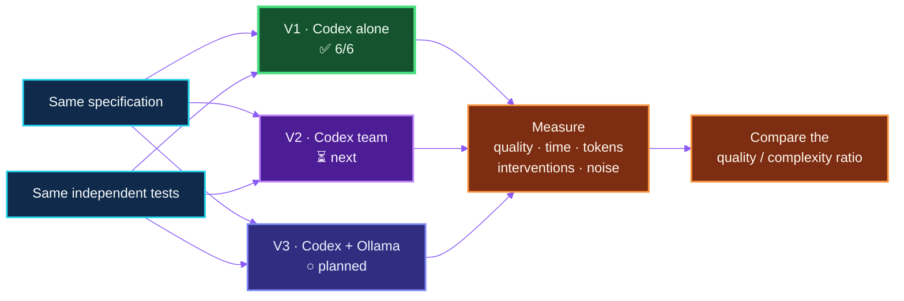
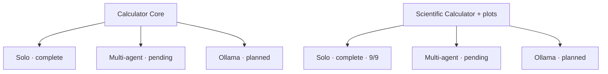

# AgentBench 2026

[Français](README.md) · **English (UK)**


> An open R&D laboratory for the social behaviour of AI agents: when several
> agents collaborate, do they create more intelligence — or merely more noise?


AgentBench 2026 is a reproducible R&D experiment inspired by Yann Pointud's
[AutoGen project](https://github.com/yannpointud/AutoGen). It is not only about
generating code. It observes a small society of agents at work: specialisation,
coordination, disagreement, control, communication cost and the ability to
detect and correct errors.

The project was conceived and steered **entirely through a microphone with
Codex** by [Éric Racineux](https://www.linkedin.com/in/eric-racineux-75475a7/).
The human–agent conversation is therefore part of the experiment, just as much
as the software it produces.

## The question

> Does a team of agents produce a better result than one capable agent once
> time, token use, coordination noise and added complexity are taken into
> account?

Every organisation tackling the same challenge receives the same
specification, constraints, independent tests and clean working directory. It
may neither inspect nor reuse another candidate's solution.

## Progress

| Version | Organisation | Status | Result |
| --- | --- | --- | --- |
| **V1** | One general-purpose Codex agent | **Complete and published** | **Core 6/6 · Scientific 9/9** |
| **V2** | Codex orchestrator + bounded specialists | Next experiment | — |
| **V3** | Codex + local Ollama models | Planned | — |
| **V4** | Historical AutoGen control | Optional | — |

**V1 is currently the only organisation evaluated.** It now provides two solo
baselines, Core and Scientific; no multi-agent conclusion will be drawn before
V2 has run.

## Experimental design



The governing rule is simple: **agents propose; the independent verifier
decides**. A team that also scores 6/6 but consumes five times as much time or
five times as many tokens is not automatically better.

## Two difficulty levels

**Calculator Core** is a short, repeatable first challenge. V1 established the
baseline on it, and V2 and V3 will tackle exactly the same task.

[**Scientific Calculator**](challenges/scientific-calculator/SPEC.md) raises
the technical bar: safe expression parsing without `eval()`, scientific
functions and constants, an `x` variable, domain handling, function sampling
and SVG curve generation. Its solo baseline scores 9/9; it will next run in
multi-agent and hybrid Ollama modes. This challenge × organisation matrix
prevents task difficulty from being mistaken for an organisational effect.



## V1 — the baseline

One Codex agent read the brief, designed and implemented the calculator,
documented its use, ran the verifier and reported the result.

- Observed model: `gpt-5.6-sol`
- Sub-agents: none
- External dependencies: none
- Observed consumption: approximately 18,086 tokens
- First known test pass: 6/6
- Final result: 6/6

The [detailed V1 report](results/codex-single-001.md) documents the work,
technical decisions, every acceptance check, available measurements and known
limitations.

The [scientific solo baseline](results/scientific-single-001.md) scores 9/9 in
331 seconds after two autonomous corrections. It adds safe parsing, scientific
functions and dependency-free SVG curve generation.

## V2 and V3 — where the social experiment begins

V2 will give bounded roles to several Codex agents: analysis, architecture,
critique and test review. Only one writer will control the solution, while the
orchestrator retains final decision authority. The experiment will observe
whether plurality discovers more defects or merely increases disagreement and
iteration.

V3 will replace selected specialists with local Ollama models. It will test
whether smaller models can provide useful dissent without another commercial
API, while Codex continues to orchestrate, decide and edit the repository.

## What is measured

- functional compliance and robustness;
- code readability and documentation quality;
- elapsed time, tokens, calls and corrections;
- human interventions;
- disagreement, decisions and coordination noise;
- agents' ability to detect their own errors;
- the ratio between delivered quality and organisational complexity.

## Reproducing V1

Requirements: Linux, Python 3.10 or later, Git and Codex CLI connected through
a ChatGPT subscription. No OpenAI API key is required.

```bash
python3 scripts/new_run.py codex-single-001
cd runs/codex-single-001
codex "$(cat ../../prompts/codex-single.md)"
cd ../..
python3 scripts/verify.py --solution runs/codex-single-001/solution
```

Every attempt must use a new identifier and clean directory.

## Transparency and governance

The small [`governance/`](governance/) package defines instruction hierarchy,
response format and public logging policy. The [public history](logs/history.md)
contains numbered summaries of requests and responses, without timestamps,
secrets or raw personal transcripts.

A [French technical note about SSH in VS Code and WSL](docs/ssh-vscode.md)
explains why a protected key may ask for its passphrase again and how to use
`ssh-agent` without storing that passphrase in the repository or an environment
variable.

Failures will be retained alongside successes. Missing measurements will not
be reconstructed after the fact, and human intervention will be distinguished
from candidate work.

## About the author

[Éric Racineux](https://www.linkedin.com/in/eric-racineux-75475a7/) is an
information systems architect and IT leader with more than thirty years of
experience spanning software development, industry, infrastructure, cloud,
cybersecurity, project leadership and organisational change.

AgentBench 2026 is his first substantial public proof of concept built with
Codex operating as an AI agent. It applies an experimental, CI/CD-style Git
workflow: versioned specifications, isolated runs, independent tests, reports,
history and continuous publication. It explores both software engineering and
the way agents divide work, disagree and govern one another.

[LinkedIn profile](https://www.linkedin.com/in/eric-racineux-75475a7/)
· [Online CV](https://ericrac.github.io/CV-Eric-RACINEUX/)

## Licence

MIT. AutoGen remains an independent project owned by its author; it is neither
included nor forked here.
