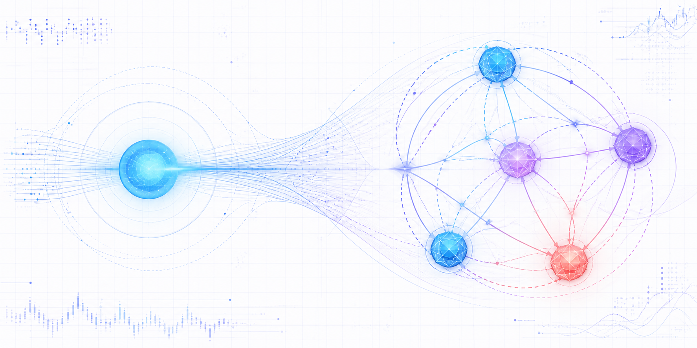
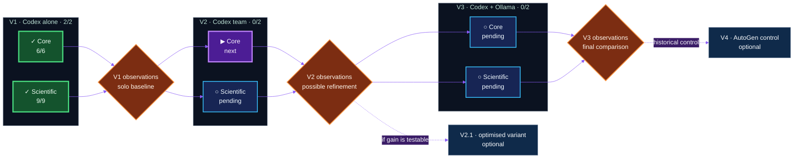
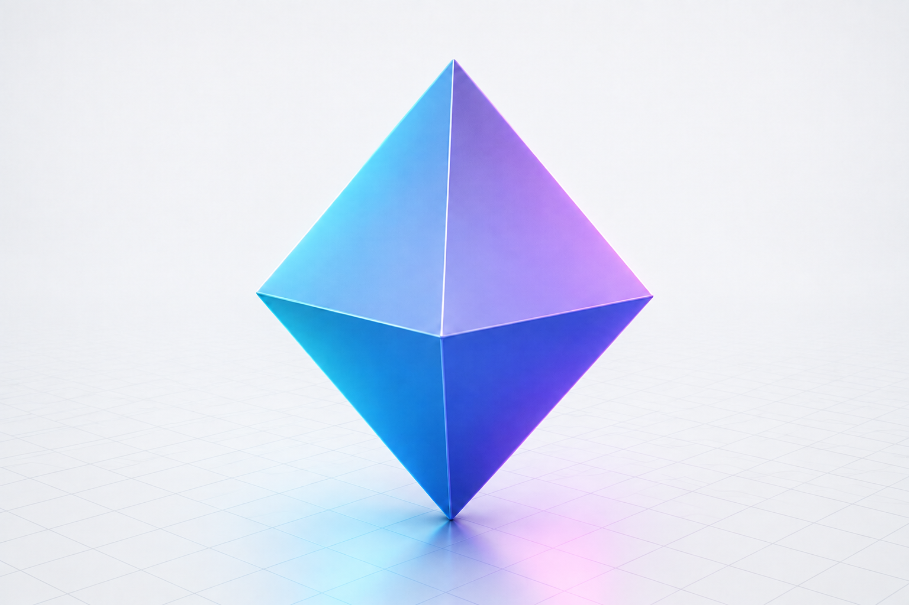

# AgentBench 2026

[Français](README.md) · **English (UK)**

<picture>
  <source media="(prefers-color-scheme: dark)" srcset="assets/agentbench-social-agents.png">
  <source media="(prefers-color-scheme: light)" srcset="assets/agentbench-social-agents-light.png">
  
</picture>

> An open R&D laboratory for the social behaviour of AI agents: when several
> agents collaborate, do they create more intelligence — or merely more noise?


AgentBench 2026 compares three agent organisations across two related
challenges. It measures the outcome as well as elapsed time, tokens,
corrections, human interventions and coordination noise.

The project was conceived and steered **entirely through a microphone with
Codex** by [Éric Racineux](https://www.linkedin.com/in/eric-racineux-75475a7/).
The human–agent conversation is therefore part of the experiment, just as much
as the software it produces.

## Dashboard — current state

| Main campaign | V1 · Codex alone | Next run | Protocols |
| :---: | :---: | :---: | :---: |
| **2 / 6 validated** | **2 / 2 complete** | **V2 · Core** | **Core + Scientific frozen** |
| `██████░░░░░░` **33%** | Core **6/6** · Scientific **9/9** | Governed multi-agent | Independent verifiers |



**How to read it:** the six V1–V3 × Core–Scientific cells form the mandatory
campaign. V2.1 and V4 are not included in the 2/6 count: they are explicitly
optional extensions.

## The research question

> Does a team of agents produce a better result than one capable agent once
> time, token use, coordination noise and added complexity are taken into
> account?

Every organisation tackling the same challenge receives the same
specification, constraints, independent tests and clean working directory. It
may neither inspect nor reuse another attempt's solution. **Agents propose;
the independent verifier decides.**

The score is therefore only part of the picture:

```text
experimental value = delivered quality / (time + tokens + coordination)
```

## Published results

| Run | Organisation | Challenge | Verdict | Time | Observed tokens |
| --- | --- | --- | ---: | ---: | ---: |
| [`codex-single-001`](results/codex-single-001.md) | V1 · Codex alone | Core | **6/6** | not recorded | ≈ 18,086 |
| [`scientific-single-001`](results/scientific-single-001.md) | V1 · Codex alone | Scientific | **9/9** | 331 s | 332,696¹ |

¹ Observed input + output; the [scientific report](results/scientific-single-001.md)
separates cache, reasoning and corrections. Missing data is never reconstructed
after the event.

## V1, V2, V3… and the case for V2.1 or V4

- **V1 — solo baseline:** one general-purpose Codex agent with no delegation.
  Both difficulty levels are complete.
- **V2 — Codex society:** an orchestrator and specialists with bounded
  assignments, with only one writer. It measures the benefit and cost of
  coordination.
- **V2.1 — optional optimisation:** considered only after full V2 analysis. It
  may test a refined organisation without replacing or polishing V2.
- **V3 — local hybrid:** Codex orchestrates, decides and writes; local Ollama
  models analyse or critique within limited context.
- **V4 — optional historical control:** a comparable reproduction of the
  AutoGen approach that inspired this project, after the main matrix.

“Refinement” may concern model version, prompt, roles, context or parameters;
it does not necessarily mean training model weights. Observations are recorded
at every gate before any decision. A substantial change opens a **new
campaign**, and the V1-to-current cells needed for comparison are rerun under
the same configuration. Earlier results remain published.

The comparison and versioning rules are defined in the French
[`governance/EXPERIMENTAL_DESIGN.md`](governance/EXPERIMENTAL_DESIGN.md).

## Experimental TODO

- [x] Freeze the **Calculator Core** and **Scientific Calculator** challenges and verifiers.
- [x] Publish V1 Core: `codex-single-001`, **6/6**.
- [x] Publish V1 Scientific: `scientific-single-001`, **9/9**.
- [x] Record V1 observations and the observed model baseline.
- [ ] Freeze V2 roles, prompts and metrics before execution.
- [ ] Run and publish **V2 Core**, then **V2 Scientific**.
- [ ] Hold the V2 observation gate; decide against written criteria whether V2.1 adds a testable hypothesis.
- [ ] If activated, run V2.1 separately on both difficulty levels.
- [ ] Freeze V3's Ollama integration, local models and context limits.
- [ ] Run and publish **V3 Core**, then **V3 Scientific**.
- [ ] Compare the six main runs: quality, cost, corrections, interventions and social noise.
- [ ] Decide after the synthesis whether the historical V4 control is worthwhile.
- [ ] After any substantial refinement, open a new campaign and rerun comparable V1…Vn baselines.

## Two difficulty levels

**Calculator Core** is short and repeatable. **Scientific Calculator** raises
the bar with safe expression parsing without `eval()`, scientific functions
and constants, an `x` variable, domain handling, sampling and dependency-free
SVG plots.

<details>
<summary><strong>What is measured</strong></summary>

- functional compliance and robustness;
- code readability and documentation quality;
- elapsed time, tokens, calls and corrections;
- human interventions;
- disagreement, decisions and coordination noise;
- agents' ability to detect their own errors;
- delivered quality relative to organisational complexity.

</details>

<details>
<summary><strong>Reproduce a V1 baseline</strong></summary>

Requirements: Linux, Python 3.10 or later, Git and Codex CLI connected through
a ChatGPT subscription. No OpenAI API key is required.

```bash
python3 scripts/new_run.py my-v1-run
cd runs/my-v1-run
codex "$(cat ../../prompts/codex-single.md)"
cd ../..
python3 scripts/verify.py --solution runs/my-v1-run/solution
```

Every attempt uses a unique identifier and a clean directory. Select the
scientific challenge with `--challenge scientific-calculator`.

</details>

<details>
<summary><strong>Governance, transparency and repository layout</strong></summary>

The [`governance/`](governance/) package defines instruction hierarchy,
experimental design, reporting and public logging. The [public history](logs/history.md)
records decisions without work times, secrets or raw personal transcripts.
Failures remain visible alongside successes.

```text
challenges/   specifications and independent tests
prompts/      exact prompts given to candidates
runs/         clean workspaces and produced solutions
results/      detailed results and future comparisons
governance/   conduct and reporting rules
logs/         concise public history
scripts/      run creation and verification
```

A [French SSH note for VS Code and WSL](docs/ssh-vscode.md) explains how to use
a dedicated key through `ssh-agent` without storing its passphrase in the
repository.

</details>

## About the author

[Éric Racineux](https://www.linkedin.com/in/eric-racineux-75475a7/) is an
information systems architect and IT leader with more than thirty years of
experience spanning software development, industry, infrastructure, cloud,
cybersecurity, project leadership and organisational change.

AgentBench 2026 is his first substantial public proof of concept built with
Codex operating as an AI agent and a CI/CD-style Git workflow: versioned
specifications, isolated runs, independent tests, reports, history and
continuous publication.

[LinkedIn profile](https://www.linkedin.com/in/eric-racineux-75475a7/)
· [Online CV](https://ericrac.github.io/CV-Eric-RACINEUX/)

## Licence

MIT. AutoGen remains an independent project owned by its author; it is neither
included nor forked here.

## Bonus — AgentBench in 3D

This small octahedral crystal represents the six main experiments around one
decision centre. Its preview automatically follows the visitor's theme.

<picture>
  <source media="(prefers-color-scheme: dark)" srcset="assets/agentbench-crystal-dark.png">
  <source media="(prefers-color-scheme: light)" srcset="assets/agentbench-crystal-light.png">
  
</picture>

<details>
<summary><strong>Manipulate the interactive STL model</strong></summary>

GitHub controls the interactive viewer background, so it does not follow the
README theme. The model remains [available to download as STL](assets/agentbench-crystal.stl).

```stl
solid agentbench_crystal
  facet normal 0.577350 0.577350 0.577350
    outer loop
      vertex 0 0 14
      vertex 10 0 0
      vertex 0 10 0
    endloop
  endfacet
  facet normal -0.577350 0.577350 0.577350
    outer loop
      vertex 0 0 14
      vertex 0 10 0
      vertex -10 0 0
    endloop
  endfacet
  facet normal -0.577350 -0.577350 0.577350
    outer loop
      vertex 0 0 14
      vertex -10 0 0
      vertex 0 -10 0
    endloop
  endfacet
  facet normal 0.577350 -0.577350 0.577350
    outer loop
      vertex 0 0 14
      vertex 0 -10 0
      vertex 10 0 0
    endloop
  endfacet
  facet normal 0.577350 0.577350 -0.577350
    outer loop
      vertex 0 0 -14
      vertex 0 10 0
      vertex 10 0 0
    endloop
  endfacet
  facet normal -0.577350 0.577350 -0.577350
    outer loop
      vertex 0 0 -14
      vertex -10 0 0
      vertex 0 10 0
    endloop
  endfacet
  facet normal -0.577350 -0.577350 -0.577350
    outer loop
      vertex 0 0 -14
      vertex 0 -10 0
      vertex -10 0 0
    endloop
  endfacet
  facet normal 0.577350 -0.577350 -0.577350
    outer loop
      vertex 0 0 -14
      vertex 10 0 0
      vertex 0 -10 0
    endloop
  endfacet
endsolid agentbench_crystal
```

</details>
