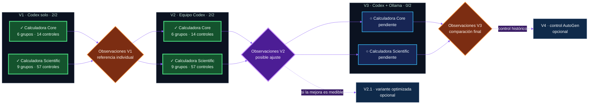

# AgentBench 2026

[Français](README.md) · [English (UK)](README.en.md) · **Español** · [Português](README.pt.md)

Laboratorio I+D sobre colaboración de agentes: las calculadoras son ejercicios comunes. V1 = un candidato solo; V2 = un escritor y tres consultores; V3 = futuros consultores locales. Se miden calidad, tiempo y tokens: no se promete que V2 sea mejor.

[Guide](docs/reading-guide.es.md) · [V2 Astra medium](results/astra-medium-v2.es.md) · [Astra/high](results/astra-v2-retired.es.md) · [requirements.txt](requirements.txt)

<picture>
  <source media="(prefers-color-scheme: dark)" srcset="assets/agentbench-social-agents.png">
  <source media="(prefers-color-scheme: light)" srcset="assets/agentbench-social-agents-light.png">
  
</picture>

> Un laboratorio abierto de I+D sobre el comportamiento social de los agentes
> de IA: cuando varios agentes colaboran, ¿generan más inteligencia o sobre todo
> más ruido?


AgentBench 2026 compara tres organizaciones de agentes en dos retos de la misma
familia. Mide el resultado, pero también el tiempo, los tokens, las
correcciones, las intervenciones humanas y el ruido de coordinación.

El proyecto fue concebido y dirigido **íntegramente mediante micrófono con
Codex** por [Éric Racineux](https://www.linkedin.com/in/eric-racineux-75475a7/).

Campaña activa: **Sol high · `sol-high-control-001`**. [Catálogo de 71 controles](docs/acceptance-tests.es.md) · [Control V1 Sol](results/sol-vs-astra-v1.es.md) · [Síntesis V2](results/sol-v2.es.md) · [Archivo V1](results/ARCHIVE_V1.es.md).

[Node.js / WSL / Markdown](docs/node-wsl.es.md) · [V2 preflight](results/astra-v2-preflight.es.md).

## Panel de control — estado actual

| Campaña principal | V1 · Codex solo | Próxima ejecución | Protocolos |
| :---: | :---: | :---: | :---: |
| **4 / 6 validadas** | **2 / 2 replicadas** | **Hito de observación V2** | **Retos y protocolo V2 fijados** |
| `████████░░░░` **67 %** | Core **6 grupos · 14 controles** · Scientific **9 grupos · 57 controles** | Comparar mejora y ruido | Verificadores independientes |



Las seis celdas V1–V3 × Calculadora Core–Calculadora Scientific forman la
campaña obligatoria. V2.1 y V4 son extensiones opcionales.

## Pregunta experimental

> ¿Un equipo de agentes produce un resultado mejor que un único buen agente
> cuando se contabilizan el tiempo, los tokens, el ruido de coordinación y la
> complejidad añadida?

Cada organización recibe la misma especificación, restricciones, pruebas
independientes y un directorio limpio. No puede consultar ni reutilizar la
solución de otro intento. **Los agentes proponen; el verificador decide.**

```math
\text{valor experimental}
=
\frac{\text{calidad obtenida}}
{\text{tiempo} + \text{tokens} + \text{coordinación}}
```

La fórmula ilustra la intuición del proyecto; no es una puntuación que sume unidades incompatibles. Los informes comparan calidad, segundos, tokens y coordinación por separado.

## Qué se prueba realmente

`6/6` y `9/9` cuentan **grupos `unittest`**, no todas las aserciones. En una
ejecución correcta, los 15 grupos realizan **71 controles: 14 Core y 57
Scientific**.

### Core — 6 grupos / 14 controles

- [x] C01 archivos (2); C02 sin ejecución dinámica (1).
- [x] C03 cuatro operaciones verificadas por separado (4).
- [x] C04 operador desconocido (1); C05 división por cero (1).
- [x] C06 CLI, errores y recuperación (5).

### Scientific — 9 grupos / 57 controles

- [x] S01 entregables y documentación (7); S02 seguridad (2).
- [x] S03 operadores y prioridades (10); S04 lenguaje matemático (6).
- [x] S05 variable y nombres prohibidos (5); S06 errores (6).
- [x] S07 muestreo (8); S08 SVG pasivo (7); S09 CLI (6).

**Auditoría:** [71 controles detallados](docs/acceptance-tests.es.md) →
[especificaciones y tests](challenges/) → [resultados](results/README.es.md) →
actas y trazas. La cobertura no es una nota absoluta de calidad.

## Resultados publicados

| Ejecución | Organización | Objetivo | Veredicto | Tiempo | Tokens observados |
| --- | --- | --- | ---: | ---: | ---: |
| [`astra-core-v1-002`](results/astra-v1.es.md) | V1 · Referencia Astra | Calculadora Core | **6/6 grupos · 14/14 controles** | 100.175 s | 120 478¹ |
| [`astra-scientific-v1-002`](results/astra-v1.es.md) | V1 · Referencia Astra | Calculadora Scientific | **9/9 grupos · 57/57 controles** | 399.478 s | 220 510¹ |
| [`sol-core-v1-001`](results/sol-vs-astra-v1.es.md) | V1 · Control Sol | Calculadora Core | **6/6 grupos · 14/14 controles** | 189.964 s | 158 101¹ |
| [`sol-scientific-v1-001`](results/sol-vs-astra-v1.es.md) | V1 · Control Sol | Calculadora Scientific | **9/9 grupos · 57/57 controles** | 1 009.468 s | 296 275¹ |
| [`sol-core-v2-001`](results/sol-v2-core.es.md) | V2 · Equipo Sol | Calculadora Core | **6/6 grupos · 14/14 controles** | 796.534 s | 559 088¹ |
| [`sol-scientific-v2-001`](results/sol-v2.es.md) | V2 · Equipo Sol | Calculadora Scientific | **9/9 grupos · 57/57 controles** | 1 587.605 s | 916 538¹ |
| [`astra-core-v2-001`](results/astra-v2-core.es.md) | V2 · Equipo Astra | Calculadora Core | **6/6 grupos · 14/14 controles** | 700.994 s | 572 168¹ |
| [`astra-medium-core-v2-001`](results/astra-medium-v2.es.md) | V2 · Equipo Astra medium | Calculadora Core | **6/6 grupos · 14/14 controles** | 375.169 s | 408 616¹ |

¹ Entrada + salida acumuladas. Los informes separan caché, razonamiento y
correcciones; los datos ausentes nunca se reconstruyen a posteriori.

## V1, V2, V3… V2.1 y V4

- **V1:** el orquestador experimental encarga el trabajo a una sesión candidata
  Codex distinta; esta trabaja sola, sin consultores ni delegación.
- **V2:** orquestador Codex y especialistas con misiones acotadas y un solo redactor.
- **V2.1:** optimización exploratoria opcional, únicamente tras analizar V2.
- **V3:** Codex orquesta, decide y escribe; modelos Ollama locales analizan o critican.
- **V4:** control histórico opcional del proyecto multiagente de Yann Pointud,
  llamado AutoGen pero independiente del framework homónimo de Microsoft.

Un cambio sustancial de modelo, prompt, roles, contexto o parámetros abre una
**nueva campaña**. Se repiten las referencias comparables V1…Vn y se conservan
los resultados anteriores. Véase el [plan experimental](governance/EXPERIMENTAL_DESIGN.es.md).

## Tareas experimentales

- [x] Congelar las pruebas de Calculadora Core y Calculadora Scientific.
- [x] Conservar las primeras observaciones V1 `001` sin reescribirlas.
- [x] Replicar V1 con modelo, esfuerzo y contexto fijados: Core `astra-core-v1-002` **6/6**, Scientific `astra-scientific-v1-002` **9/9**.
- [x] Controlar V1 con Sol/high: **15/15 grupos y 71/71 controles elementales**, con [comparación publicada](results/sol-vs-astra-v1.es.md).
- [x] Decidir y fijar roles, intercambios, presupuestos y [métricas V2](governance/V2_PROTOCOL.es.md).
- [x] Validar el preflight V2: aislamiento, configuración por rol, trazas visibles y contadores. [PV](results/astra-v2-preflight.es.md).
- [x] Ejecutar y publicar V2 Calculadora Core: **6/6 grupos y 14/14 controles**, con [informe y acta](results/sol-v2-core.es.md).
- [x] Ejecutar y publicar V2 Calculadora Scientific sin cambiar el protocolo: **9/9 grupos y 57/57 controles**, con [síntesis V2](results/sol-v2.es.md).
- [ ] Analizar V2 y decidir si V2.1 aporta una hipótesis medible.
- [ ] Congelar los modelos Ollama y los límites de contexto de V3.
- [ ] Ejecutar V3 para ambos objetivos.
- [ ] Comparar las seis ejecuciones principales.
- [ ] Decidir si el control histórico V4 aporta información útil.

<details>
<summary><strong>Medidas y reproducción</strong></summary>

Se observan conformidad, robustez, calidad del código y la documentación,
duración, tokens, llamadas, correcciones, intervención humana, desacuerdos,
ruido de coordinación y textos visibles entre profesiones, conservados en un
[acta experimental](governance/PV_TEMPLATE.es.md).

```bash
python3 scripts/new_run.py mi-run-v1
cd runs/mi-run-v1
python3 ../../scripts/capture_session.py --cwd solution --prompt ../../prompts/codex-single.md --config ../../governance/astra-v1.toml
cd ../..
python3 scripts/verify.py --solution runs/mi-run-v1/solution
```

Cada intento utiliza un identificador nuevo y un directorio limpio.

</details>

<details>
<summary><strong>Gobernanza y transparencia</strong></summary>

El directorio [`governance/`](governance/) define las instrucciones, el plan
experimental, las respuestas y el registro público. El
[historial](logs/history.es.md) conserva decisiones sin horarios de trabajo,
secretos ni transcripciones personales completas.

</details>

## Sobre el autor

[Éric Racineux](https://www.linkedin.com/in/eric-racineux-75475a7/) es
arquitecto de sistemas de información y responsable de TI con más de treinta
años de experiencia. AgentBench 2026 es su primer POC público sustancial con
Codex como agente de IA y una cadena Git de estilo CI/CD.

[Perfil de LinkedIn](https://www.linkedin.com/in/eric-racineux-75475a7/)
· [CV en línea](https://ericrac.github.io/CV-Eric-RACINEUX/)

## Licencia

MIT. El AutoGen de Yann Pointud es un proyecto independiente; no está incluido
ni bifurcado aquí y no usa el framework homónimo de Microsoft.

## Bonus — AgentBench en 3D

<picture>
  <source media="(prefers-color-scheme: dark)" srcset="assets/agentbench-crystal-dark.png">
  <source media="(prefers-color-scheme: light)" srcset="assets/agentbench-crystal-light.png">
  
</picture>

[Descargar y manipular el modelo STL](assets/agentbench-crystal.stl).
