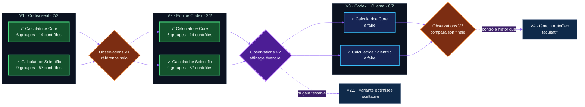

# AgentBench 2026

**Français** · [English (UK)](README.en.md) · [Español](README.es.md) · [Português](README.pt.md)

Laboratoire R&D sur la collaboration des agents : les calculatrices sont les exercices communs. V1 = un candidat seul ; V2 = un écrivain et trois consultants ; V3 = futurs consultants locaux. On mesure qualité, temps et tokens : V2 n'est pas promise meilleure.

[Guide](docs/reading-guide.md) · [V2 Astra medium](results/astra-medium-v2.md) · [Astra/high](results/astra-v2-retired.md) · [requirements.txt](requirements.txt)

<picture>
  <source media="(prefers-color-scheme: dark)" srcset="assets/agentbench-social-agents.png">
  <source media="(prefers-color-scheme: light)" srcset="assets/agentbench-social-agents-light.png">
  
</picture>

> Un laboratoire R&D ouvert sur le comportement social des agents IA : quand
> plusieurs agents collaborent, produisent-ils davantage d'intelligence… ou
> surtout davantage de bruit ?


AgentBench 2026 compare trois organisations d'agents sur deux défis de même
famille. Il mesure le résultat, mais aussi le temps, les tokens, les
corrections, les interventions humaines et le bruit de coordination.

Le projet a été imaginé et piloté **entièrement au microphone avec Codex** par
[Éric Racineux](https://www.linkedin.com/in/eric-racineux-75475a7/). Le dialogue
humain–agent fait donc partie de l'expérience autant que le code produit.

Campagne active : **Sol high · `sol-high-control-001`**. [Catalogue des 71 contrôles](docs/acceptance-tests.md) · [Contrôle V1 Sol](results/sol-vs-astra-v1.md) · [Synthèse V2](results/sol-v2.md) · [Archives V1](results/ARCHIVE_V1.md).

[Node.js / WSL / Markdown](docs/node-wsl.md) · [V2 preflight](results/astra-v2-preflight.md).

## Tableau de bord — état actuel

| Campagne principale | V1 · Codex seul | Prochain run | Protocoles |
| :---: | :---: | :---: | :---: |
| **4 / 6 validés** | **2 / 2 répliqués** | **Jalon d'observation V2** | **Défis et protocole V2 figés** |
| `████████░░░░` **67 %** | Core **6 groupes · 14 contrôles** · Scientific **9 groupes · 57 contrôles** | Comparer gain et bruit | Vérificateurs indépendants |



**Lecture :** les six cases V1–V3 × Calculatrice Core–Calculatrice Scientific
constituent la campagne obligatoire. V2.1 et V4 n'entrent pas dans le calcul
des 4/6 : ce sont des
extensions facultatives, annoncées comme telles.

## La question expérimentale

> Une équipe d'agents produit-elle un meilleur résultat qu'un seul bon agent,
> une fois comptés le temps, les tokens, le bruit de coordination et la
> complexité ajoutée ?

Toutes les variantes d'un même défi reçoivent la même spécification, les mêmes
contraintes, les mêmes tests indépendants et un répertoire vierge. Elles ne
peuvent ni lire ni réutiliser la solution d'une autre tentative. **Les agents
proposent ; le vérificateur tranche.**

La lecture ne se limite donc pas au score :

```math
\text{valeur expérimentale}
=
\frac{\text{qualité obtenue}}
{\text{temps} + \text{tokens} + \text{coordination}}
```

Cette formule illustre l'intuition du projet ; elle n'additionne pas des unités incompatibles dans un score calculé. Qualité, secondes, tokens et coordination sont comparés séparément dans les rapports.

## Ce qui est réellement testé

Les verdicts `6/6` et `9/9` comptent des **groupes `unittest`**, pas toutes les
assertions. Sur un passage réussi, les 15 groupes exécutent **71 contrôles
élémentaires : 14 Core et 57 Scientific**.

### Calculatrice Core — 6 groupes / 14 contrôles

- [x] C01 · Deux livrables présents — 2 contrôles.
- [x] C02 · Aucun `eval()` ou `exec()` — 1 contrôle.
- [x] C03 · Addition, soustraction, multiplication et division — **4 contrôles**.
- [x] C04 · Opérateur inconnu rejeté — 1 contrôle.
- [x] C05 · Division par zéro rejetée — 1 contrôle.
- [x] C06 · CLI sans traceback, avec erreur lisible et reprise — 5 contrôles.

### Calculatrice Scientific — 9 groupes / 57 contrôles

- [x] S01 · Livrables et documentation — 7 contrôles.
- [x] S02 · Sécurité et bibliothèque standard — 2 contrôles.
- [x] S03 · Priorités, parenthèses, puissances et signes — 10 contrôles.
- [x] S04 · Fonctions, constantes et notation scientifique — 6 contrôles.
- [x] S05 · Variable `x` et noms interdits — 5 contrôles.
- [x] S06 · Syntaxe, domaines et division par zéro — 6 contrôles.
- [x] S07 · Échantillonnage, bornes et discontinuités — 8 contrôles.
- [x] S08 · SVG valide, tracé et sans contenu actif — 7 contrôles.
- [x] S09 · CLI, courbe, historique et récupération — 6 contrôles.

**Parcours d'audit recommandé :** [liste détaillée des 71 contrôles](docs/acceptance-tests.md)
→ [spécifications et tests sources](challenges/) → [résultats](results/README.md)
→ PV et traces de chaque run. Les cases ci-dessus décrivent la couverture des
suites actuelles ; elles ne constituent pas une note absolue de qualité.

## Résultats publiés

| Run | Organisation | Défi | Verdict | Temps | Tokens observés |
| --- | --- | --- | ---: | ---: | ---: |
| [`astra-core-v1-002`](results/astra-v1.md) | V1 · Référence Astra | Calculatrice Core | **6/6 groupes · 14/14 contrôles** | 100.175 s | 120 478¹ |
| [`astra-scientific-v1-002`](results/astra-v1.md) | V1 · Référence Astra | Calculatrice Scientific | **9/9 groupes · 57/57 contrôles** | 399.478 s | 220 510¹ |
| [`sol-core-v1-001`](results/sol-vs-astra-v1.md) | V1 · Contrôle Sol | Calculatrice Core | **6/6 groupes · 14/14 contrôles** | 189.964 s | 158 101¹ |
| [`sol-scientific-v1-001`](results/sol-vs-astra-v1.md) | V1 · Contrôle Sol | Calculatrice Scientific | **9/9 groupes · 57/57 contrôles** | 1 009.468 s | 296 275¹ |
| [`sol-core-v2-001`](results/sol-v2-core.md) | V2 · Équipe Sol | Calculatrice Core | **6/6 groupes · 14/14 contrôles** | 796.534 s | 559 088¹ |
| [`sol-scientific-v2-001`](results/sol-v2.md) | V2 · Équipe Sol | Calculatrice Scientific | **9/9 groupes · 57/57 contrôles** | 1 587.605 s | 916 538¹ |

¹ Entrée + sortie cumulées ; les rapports détaillent cache, raisonnement et
corrections. Aucune donnée manquante n'est reconstruite après coup.

## V1, V2, V3… et pourquoi V2.1 ou V4

- **V1 — référence solo :** l'orchestrateur expérimental mandate une session
  candidate Codex distincte ; celle-ci travaille seule, sans consultant ni
  délégation. Les deux niveaux sont terminés.
- **V2 — société Codex :** orchestrateur et spécialistes aux missions bornées,
  avec un seul écrivain. Elle mesure le bénéfice et le coût de la coordination.
- **V2.1 — optimisation facultative :** seulement après l'analyse complète de
  V2. Elle peut tester une organisation affinée, sans remplacer ni embellir V2.
- **V3 — hybride local :** Codex orchestre, décide et écrit ; des modèles
  Ollama locaux analysent ou critiquent dans un contexte limité.
- **V4 — témoin historique facultatif :** reproduction comparable de
  l'approche multi-agent de Yann Pointud, baptisée AutoGen mais indépendante
  du framework Microsoft du même nom, après la matrice principale.

L'« affinage » peut porter sur la version du modèle, le prompt, les rôles, le
contexte ou les paramètres. Il ne signifie pas nécessairement entraîner les
poids d'un modèle. À chaque jalon, les observations sont consignées avant toute
décision. Si un changement substantiel est retenu, il ouvre une **nouvelle
campagne** et les cellules V1 jusqu'au mode courant sont rejouées avec la même
configuration ; les anciens résultats restent publiés.

Le protocole complet de comparaison et de versionnement est décrit dans
[`governance/EXPERIMENTAL_DESIGN.md`](governance/EXPERIMENTAL_DESIGN.md).

## TODO expérimental

- [x] Figer les défis et vérificateurs **Calculatrice Core** et **Calculatrice Scientific**.
- [x] Conserver les premières observations V1 `001` sans les réécrire.
- [x] Répliquer V1 avec modèle, effort et contexte épinglés : Core `astra-core-v1-002` **6/6**, Scientific `astra-scientific-v1-002` **9/9**.
- [x] Contrôler V1 à périmètre constant avec Sol/high : **15/15 groupes et 71/71 contrôles élémentaires**, avec [comparaison publiée](results/sol-vs-astra-v1.md).
- [x] Arbitrer puis figer les rôles, échanges, budgets et [métriques V2](governance/V2_PROTOCOL.md).
- [x] Valider le préflight V2 : isolation, configuration par rôle, traces visibles et compteurs. [PV](results/astra-v2-preflight.md).
- [x] Exécuter et publier **V2 Calculatrice Core** : **6/6 groupes et 14/14 contrôles**, avec [rapport et PV](results/sol-v2-core.md).
- [x] Exécuter et publier **V2 Calculatrice Scientific** sans modifier le protocole : **9/9 groupes et 57/57 contrôles**, avec [synthèse V2](results/sol-v2.md).
- [ ] Tenir le jalon d'observation V2 ; décider avec des critères écrits si V2.1 apporte une hypothèse testable.
- [ ] Si elle est activée, exécuter V2.1 séparément sur les deux difficultés.
- [ ] Figer l'intégration Ollama, les modèles locaux et les limites de contexte de V3.
- [ ] Exécuter et publier **V3 Calculatrice Core**, puis **V3 Calculatrice Scientific**.
- [ ] Comparer les six runs principaux : qualité, coût, corrections, interventions et bruit social.
- [ ] Décider après la synthèse si le témoin historique V4 mérite d'être exécuté.
- [ ] Lors de tout affinage substantiel, ouvrir une nouvelle campagne et rejouer les références comparables V1…Vn.

## Deux niveaux de difficulté

**Calculatrice Core** est une expérience courte et répétable. **Calculatrice
Scientific** monte d'un cran : analyse sûre d'expressions sans `eval()`,
fonctions et constantes scientifiques, variable `x`, domaines,
échantillonnage et courbes SVG sans dépendance externe.

<details>
<summary><strong>Ce qui est mesuré</strong></summary>

- conformité fonctionnelle et robustesse ;
- lisibilité du code et qualité de la documentation ;
- durée, tokens, appels et corrections ;
- interventions humaines ;
- contradictions, décisions et bruit de coordination ;
- textes inter-agents visibles et influence de chaque métier, consignés dans
  un [PV expérimental](governance/PV_TEMPLATE.md) ;
- capacité des agents à détecter leurs propres erreurs ;
- rapport entre qualité obtenue et complexité organisationnelle.

</details>

<details>
<summary><strong>Reproduire une référence V1</strong></summary>

Prérequis : Linux, Python 3.10 ou supérieur, Git et Codex CLI connecté avec un
abonnement ChatGPT. Aucune clé API OpenAI n'est nécessaire.

```bash
python3 scripts/new_run.py mon-run-v1
cd runs/mon-run-v1
python3 ../../scripts/capture_session.py --cwd solution --prompt ../../prompts/codex-single.md --config ../../governance/astra-v1.toml
cd ../..
python3 scripts/verify.py --solution runs/mon-run-v1/solution
```

Chaque tentative utilise un identifiant inédit et un répertoire neuf. Le défi
scientifique se sélectionne avec l'option `--challenge scientific-calculator`.

</details>

<details>
<summary><strong>Gouvernance, transparence et structure du dépôt</strong></summary>

Le paquet [`governance/`](governance/) définit la hiérarchie des consignes, le
plan expérimental, le format de restitution et la journalisation publique. Le
[journal synthétique](logs/history.md) conserve les décisions sans heure,
secret ni transcription personnelle brute. Les échecs restent publiés autant
que les réussites.

```text
challenges/   spécifications et tests indépendants
prompts/      prompts exacts remis aux candidats
runs/         espaces vierges et solutions produites
results/      résultats détaillés et futures comparaisons
governance/   règles de conduite et de restitution
logs/         historique public synthétique
scripts/      création des runs et vérification
```

La [note SSH pour VS Code et WSL](docs/ssh-vscode.md) explique comment employer
une clé dédiée via `ssh-agent` sans stocker sa phrase secrète dans le dépôt.

</details>

## À propos de l'auteur

[Éric Racineux](https://www.linkedin.com/in/eric-racineux-75475a7/) est
architecte SI et responsable informatique, avec plus de trente ans de terrain
entre développement, industrie, infrastructures, cloud, cybersécurité,
pilotage de projets et conduite du changement.

AgentBench 2026 est son premier véritable POC public réalisé avec Codex en mode
agent IA et une chaîne Git de type CI/CD : spécifications versionnées, runs
isolés, tests indépendants, rapports, historique et publication continue.

[Consulter son profil LinkedIn](https://www.linkedin.com/in/eric-racineux-75475a7/)
· [Parcourir son CV en ligne](https://ericrac.github.io/CV-Eric-RACINEUX/)

## Licence

MIT. Le projet AutoGen de Yann Pointud reste indépendant et appartient à son
auteur ; il n'est ni inclus ni forké dans ce dépôt et ne repose pas sur le
framework Microsoft homonyme.

## Bonus — AgentBench en 3D

Un petit cristal octaédrique représente les six expériences principales autour
d'un même centre de décision. Son aperçu s'adapte automatiquement au thème du
visiteur.

<picture>
  <source media="(prefers-color-scheme: dark)" srcset="assets/agentbench-crystal-dark.png">
  <source media="(prefers-color-scheme: light)" srcset="assets/agentbench-crystal-light.png">
  
</picture>

<details>
<summary><strong>Manipuler le modèle STL interactif</strong></summary>

Le fond du lecteur interactif est imposé par GitHub et ne suit pas le thème du
README. Le modèle reste [téléchargeable au format STL](assets/agentbench-crystal.stl).

```stl
solid agentbench_crystal
  facet normal 0.577350 0.577350 0.577350
    outer loop
      vertex 0 0 14
      vertex 10 0 0
      vertex 0 10 0
    endloop
  endfacet
  facet normal -0.577350 0.577350 0.577350
    outer loop
      vertex 0 0 14
      vertex 0 10 0
      vertex -10 0 0
    endloop
  endfacet
  facet normal -0.577350 -0.577350 0.577350
    outer loop
      vertex 0 0 14
      vertex -10 0 0
      vertex 0 -10 0
    endloop
  endfacet
  facet normal 0.577350 -0.577350 0.577350
    outer loop
      vertex 0 0 14
      vertex 0 -10 0
      vertex 10 0 0
    endloop
  endfacet
  facet normal 0.577350 0.577350 -0.577350
    outer loop
      vertex 0 0 -14
      vertex 0 10 0
      vertex 10 0 0
    endloop
  endfacet
  facet normal -0.577350 0.577350 -0.577350
    outer loop
      vertex 0 0 -14
      vertex -10 0 0
      vertex 0 10 0
    endloop
  endfacet
  facet normal -0.577350 -0.577350 -0.577350
    outer loop
      vertex 0 0 -14
      vertex 0 -10 0
      vertex -10 0 0
    endloop
  endfacet
  facet normal 0.577350 -0.577350 -0.577350
    outer loop
      vertex 0 0 -14
      vertex 10 0 0
      vertex 0 -10 0
    endloop
  endfacet
endsolid agentbench_crystal
```

</details>
