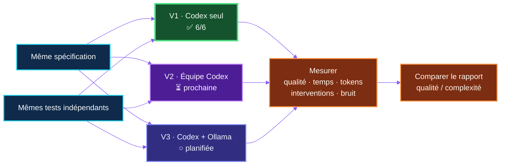
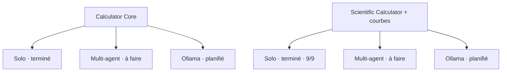

# AgentBench 2026

**Français** · [English (UK)](README.en.md)


> Un laboratoire ouvert sur le comportement social des agents IA : quand
> plusieurs agents collaborent, produisent-ils davantage d'intelligence… ou
> surtout davantage de bruit ?


AgentBench 2026 est une expérimentation R&D reproductible inspirée du projet
[AutoGen de Yann Pointud](https://github.com/yannpointud/AutoGen). Son sujet
n'est pas seulement la génération de code : il observe une petite société
d'agents au travail — spécialisation, coordination, contradictions, contrôle,
coût des échanges et capacité à corriger ses propres erreurs.

Le projet a été imaginé et piloté **entièrement au microphone avec Codex** par
[Éric Racineux](https://www.linkedin.com/in/eric-racineux-75475a7/). Le dialogue
humain–agent fait donc partie de l'expérience autant que le code produit.

## La question

> Une équipe d'agents produit-elle un meilleur résultat qu'un seul bon agent,
> une fois comptés le temps, les tokens, le bruit de coordination et la
> complexité ajoutée ?

Toutes les variantes d'un même défi reçoivent la même spécification, les mêmes
contraintes, les mêmes tests indépendants et un répertoire vierge. Elles ne
peuvent ni lire ni réutiliser la solution d'une autre variante.

## Avancement

| Version | Organisation | État | Résultat |
| --- | --- | --- | --- |
| **V1** | Un agent Codex généraliste | **Terminée et publiée** | **Core 6/6 · Scientific 9/9** |
| **V2** | Codex orchestrateur + spécialistes bornés | Prochaine expérience | — |
| **V3** | Codex + modèles Ollama locaux | Planifiée | — |
| **V4** | Témoin AutoGen historique | Facultative | — |

**La V1 est la seule organisation évaluée à ce jour.** Elle fournit désormais
deux références solo, Core et Scientific ; aucune conclusion sur le
multi-agent ne sera formulée avant la V2.

## Dispositif expérimental



La règle centrale est simple : **les agents proposent, le vérificateur
tranche**. Une équipe qui obtient également 6/6 mais consomme cinq fois plus de
temps ou de tokens n'est pas automatiquement meilleure.

## Deux niveaux de difficulté

Le premier défi, **Calculator Core**, fournit une expérience courte et facile à
répéter. C'est sur lui que la V1 a établi la référence et que V2 puis V3 seront
comparées à conditions strictement identiques.

Le second défi, [**Scientific Calculator**](challenges/scientific-calculator/SPEC.md),
monte d'un cran : analyse d'expressions sans `eval()`, fonctions
scientifiques, constantes, variable `x`, gestion des domaines, échantillonnage
de fonctions et production de courbes SVG. Sa référence solo obtient 9/9. Il
sera ensuite exécuté séparément en modes multi-agent et hybride Ollama. Changer
la difficulté entre V1 et V2 fausserait l'expérience ; la matrice croise donc
les organisations **et** les défis.



## V1 — le point de référence

Un seul agent Codex a lu le cahier des charges, conçu et écrit la calculatrice,
documenté son usage, lancé le vérificateur puis rendu compte du résultat.

- Modèle observé : `gpt-5.6-sol`
- Sous-agents : aucun
- Dépendances externes : aucune
- Consommation observée : environ 18 086 tokens
- Premier passage connu : 6/6
- Résultat final : 6/6

Le [rapport V1 détaillé](results/codex-single-001.md) décrit le traitement, les
choix techniques, chaque contrôle, les métriques disponibles et les limites de
l'expérience.

La [référence scientifique solo](results/scientific-single-001.md) atteint 9/9
en 331 secondes après deux corrections autonomes. Elle ajoute un parseur sûr,
des fonctions scientifiques et la production de courbes SVG sans dépendance
externe.

## V2 et V3 — là où l'expérience commence vraiment

La V2 donnera des rôles bornés à plusieurs agents Codex : analyse, architecture,
critique et lecture des tests. Un seul écrivain conservera la maîtrise du code,
et l'orchestrateur prendra les décisions finales. L'objectif est d'observer si
la pluralité détecte réellement plus de défauts ou si elle amplifie les
désaccords et les allers-retours.

La V3 remplacera certains spécialistes par des modèles Ollama locaux. Elle
testera si des modèles plus modestes peuvent apporter une contradiction utile
sans API commerciale supplémentaire, tout en laissant Codex orchestrer,
décider et modifier le dépôt.

## Ce qui est mesuré

- conformité fonctionnelle et robustesse ;
- lisibilité du code et qualité de la documentation ;
- durée, tokens, appels et corrections ;
- interventions humaines ;
- contradictions, décisions et bruit de coordination ;
- capacité des agents à détecter leurs propres erreurs ;
- rapport entre qualité obtenue et complexité organisationnelle.

## Reproduire la V1

Prérequis : Linux, Python 3.10 ou supérieur, Git et Codex CLI connecté avec un
abonnement ChatGPT. Aucune clé API OpenAI n'est nécessaire.

```bash
python3 scripts/new_run.py codex-single-001
cd runs/codex-single-001
codex "$(cat ../../prompts/codex-single.md)"
cd ../..
python3 scripts/verify.py --solution runs/codex-single-001/solution
```

Chaque tentative doit utiliser un identifiant inédit et un répertoire neuf.

## Transparence et gouvernance

Le petit paquet [`governance/`](governance/) définit la hiérarchie des
consignes, le format de restitution et la politique de journalisation. Le
[journal public](logs/history.md) conserve une synthèse numérotée des demandes
et réponses, sans horodatage, secret ni transcription personnelle brute.

Une [note consacrée à SSH dans VS Code et WSL](docs/ssh-vscode.md) explique
pourquoi une clé protégée redemande parfois sa phrase secrète et comment
utiliser `ssh-agent` sans placer celle-ci dans le dépôt ou dans une variable
d'environnement.

Les échecs seront conservés autant que les réussites. Les données absentes ne
seront pas reconstruites a posteriori, et les interventions humaines seront
distinguées du travail du candidat.

## Structure

```text
challenges/   spécifications et tests indépendants
prompts/      prompts exacts remis aux candidats
runs/         espaces vierges et solutions produites
results/      résultats détaillés et futures comparaisons
governance/   règles de conduite et de restitution
logs/         historique public synthétique
scripts/      création des runs et vérification
```

## À propos de l'auteur

[Éric Racineux](https://www.linkedin.com/in/eric-racineux-75475a7/) est
architecte SI et responsable informatique, avec plus de trente ans de terrain
entre développement, industrie, infrastructures, cloud, cybersécurité,
pilotage de projets et conduite du changement.

AgentBench 2026 est son premier véritable POC public réalisé avec Codex en mode
agent IA, avec une démarche expérimentale reproductible et une chaîne Git de
type CI/CD : spécifications versionnées, runs isolés, tests indépendants,
rapports, historique et publication continue. Le projet explore autant
l'ingénierie logicielle que la manière dont des agents se répartissent le
travail, se contredisent et se contrôlent.

[Consulter son profil LinkedIn](https://www.linkedin.com/in/eric-racineux-75475a7/)
· [Parcourir son CV en ligne](https://ericrac.github.io/CV-Eric-RACINEUX/)

## Licence

MIT. AutoGen reste un projet indépendant appartenant à son auteur ; il n'est
ni inclus ni forké dans ce dépôt.
