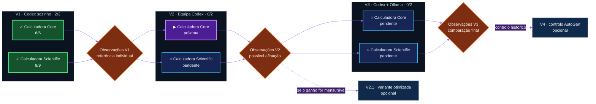

# AgentBench 2026

[Français](README.md) · [English (UK)](README.en.md) · [Español](README.es.md) · **Português**

<picture>
  <source media="(prefers-color-scheme: dark)" srcset="assets/agentbench-social-agents.png">
  <source media="(prefers-color-scheme: light)" srcset="assets/agentbench-social-agents-light.png">
  
</picture>

> Um laboratório aberto de I&D sobre o comportamento social de agentes de IA:
> quando vários agentes colaboram, produzem mais inteligência ou sobretudo mais
> ruído?


O AgentBench 2026 compara três organizações de agentes em dois desafios da
mesma família. Mede o resultado, mas também o tempo, os tokens, as correções,
as intervenções humanas e o ruído de coordenação.

O projeto foi concebido e conduzido **inteiramente por microfone com o Codex**
por [Éric Racineux](https://www.linkedin.com/in/eric-racineux-75475a7/).

## Painel — estado atual

| Campanha principal | V1 · Codex sozinho | Próxima execução | Protocolos |
| :---: | :---: | :---: | :---: |
| **2 / 6 validadas** | **2 / 2 concluídas** | **V2 · Calculadora Core** | **Core + Scientific congelados** |
| `██████░░░░░░` **33%** | Calculadora Core **6/6** · Calculadora Scientific **9/9** | Multiagente governado | Verificadores independentes |



As seis células V1–V3 × Calculadora Core–Calculadora Scientific formam a
campanha obrigatória. V2.1 e V4 são extensões opcionais.

## Pergunta experimental

> Uma equipa de agentes produz um resultado melhor do que um único bom agente
> quando se contabilizam o tempo, os tokens, o ruído de coordenação e a
> complexidade acrescentada?

Cada organização recebe a mesma especificação, restrições, testes independentes
e um diretório limpo. Não pode consultar nem reutilizar a solução de outra
tentativa. **Os agentes propõem; o verificador decide.**

```text
valor experimental = qualidade obtida / (tempo + tokens + coordenação)
```

## Resultados publicados

| Execução | Organização | Objetivo | Veredicto | Tempo | Tokens observados |
| --- | --- | --- | ---: | ---: | ---: |
| [`codex-single-001`](results/codex-single-001.pt.md) | V1 · Codex sozinho | Calculadora Core | **6/6** | não registado | ≈ 18 086 |
| [`scientific-single-001`](results/scientific-single-001.pt.md) | V1 · Codex sozinho | Calculadora Scientific | **9/9** | 331 s | 332 696¹ |

¹ Entrada + saída observadas. Os dados ausentes nunca são reconstruídos a
posteriori.

## V1, V2, V3… V2.1 e V4

- **V1:** referência individual sem delegação; ambos os objetivos estão concluídos.
- **V2:** orquestrador Codex e especialistas com missões limitadas e um único redator.
- **V2.1:** otimização exploratória opcional, apenas após a análise da V2.
- **V3:** o Codex orquestra, decide e escreve; modelos Ollama locais analisam ou criticam.
- **V4:** controlo histórico AutoGen opcional após a matriz principal.

Uma alteração substancial do modelo, prompt, papéis, contexto ou parâmetros
abre uma **nova campanha**. As referências comparáveis V1…Vn são repetidas e
os resultados anteriores são preservados. Consulte o
[plano experimental](governance/EXPERIMENTAL_DESIGN.pt.md).

## Tarefas experimentais

- [x] Congelar os testes da Calculadora Core e da Calculadora Scientific.
- [x] Publicar V1 Core: **6/6**.
- [x] Publicar V1 Scientific: **9/9**.
- [ ] Congelar papéis, prompts e métricas da V2.
- [ ] Executar V2 para a Calculadora Core e a Calculadora Scientific.
- [ ] Analisar V2 e decidir se V2.1 oferece uma hipótese mensurável.
- [ ] Congelar os modelos Ollama e os limites de contexto da V3.
- [ ] Executar V3 para ambos os objetivos.
- [ ] Comparar as seis execuções principais.
- [ ] Decidir se o controlo histórico V4 acrescenta informação útil.

<details>
<summary><strong>Medições e reprodução</strong></summary>

São observados conformidade, robustez, qualidade do código e da documentação,
duração, tokens, chamadas, correções, intervenção humana, divergências e ruído
de coordenação.

```bash
python3 scripts/new_run.py meu-run-v1
cd runs/meu-run-v1
codex "$(cat ../../prompts/codex-single.md)"
cd ../..
python3 scripts/verify.py --solution runs/meu-run-v1/solution
```

Cada tentativa utiliza um identificador novo e um diretório limpo.

</details>

<details>
<summary><strong>Governação e transparência</strong></summary>

O diretório [`governance/`](governance/) define as instruções, o plano
experimental, as respostas e o registo público. O
[histórico](logs/history.pt.md) preserva decisões sem horários de trabalho,
segredos ou transcrições pessoais completas.

</details>

## Sobre o autor

[Éric Racineux](https://www.linkedin.com/in/eric-racineux-75475a7/) é arquiteto
de sistemas de informação e responsável de TI com mais de trinta anos de
experiência. O AgentBench 2026 é o seu primeiro POC público substancial com o
Codex como agente de IA e uma cadeia Git ao estilo CI/CD.

[Perfil LinkedIn](https://www.linkedin.com/in/eric-racineux-75475a7/)
· [CV online](https://ericrac.github.io/CV-Eric-RACINEUX/)

## Licença

MIT. O AutoGen é um projeto independente; não está incluído nem bifurcado aqui.

## Bónus — AgentBench em 3D

<picture>
  <source media="(prefers-color-scheme: dark)" srcset="assets/agentbench-crystal-dark.png">
  <source media="(prefers-color-scheme: light)" srcset="assets/agentbench-crystal-light.png">
  
</picture>

[Transferir e manipular o modelo STL](assets/agentbench-crystal.stl).
