# AgentBench 2026

[Français](README.md) · [English (UK)](README.en.md) · [Español](README.es.md) · **Português**

<picture>
  <source media="(prefers-color-scheme: dark)" srcset="assets/agentbench-social-agents.png">
  <source media="(prefers-color-scheme: light)" srcset="assets/agentbench-social-agents-light.png">
  
</picture>

> Um laboratório aberto de I&D sobre o comportamento social de agentes de IA:
> quando vários agentes colaboram, produzem mais inteligência ou sobretudo mais
> ruído?


O AgentBench 2026 compara três organizações de agentes em dois desafios da
mesma família. Mede o resultado, mas também o tempo, os tokens, as correções,
as intervenções humanas e o ruído de coordenação.

O projeto foi concebido e conduzido **inteiramente por microfone com o Codex**
por [Éric Racineux](https://www.linkedin.com/in/eric-racineux-75475a7/).

Campanha ativa: **Sol high · `sol-high-control-001`**. [Catálogo de 71 controlos](docs/acceptance-tests.pt.md) · [Controlo V1 Sol](results/sol-vs-astra-v1.pt.md) · [Síntese V2](results/sol-v2.pt.md) · [Arquivo V1](results/ARCHIVE_V1.pt.md).

[Node.js / WSL / Markdown](docs/node-wsl.pt.md) · [V2 preflight](results/astra-v2-preflight.pt.md).

## Painel — estado atual

| Campanha principal | V1 · Codex sozinho | Próxima execução | Protocolos |
| :---: | :---: | :---: | :---: |
| **4 / 6 validadas** | **2 / 2 replicadas** | **Marco de observação V2** | **Desafios e protocolo V2 congelados** |
| `████████░░░░` **67%** | Core **6 grupos · 14 controlos** · Scientific **9 grupos · 57 controlos** | Comparar ganho e ruído | Verificadores independentes |

```mermaid
%%{init: {"theme": "base", "themeVariables": {
  "primaryColor": "#0f2a4a", "primaryTextColor": "#f8fafc",
  "primaryBorderColor": "#22d3ee", "secondaryColor": "#3b1d67",
  "tertiaryColor": "#431f2b", "fontFamily": "system-ui",
  "lineColor": "#8b5cf6", "clusterBkg": "#0b1220",
  "clusterBorder": "#475569"
}}}%%
flowchart LR
    subgraph V1["V1 · Codex sozinho · 2/2"]
      V1C["✓ Calculadora Core<br/>6 grupos · 14 controlos"]
      V1S["✓ Calculadora Scientific<br/>9 grupos · 57 controlos"]
    end
    G1{"Observações V1<br/>referência individual"}
    subgraph V2["V2 · Equipa Codex · 2/2"]
      V2C["✓ Calculadora Core<br/>6 grupos · 14 controlos"]
      V2S["✓ Calculadora Scientific<br/>9 grupos · 57 controlos"]
    end
    G2{"Observações V2<br/>possível afinação"}
    V21["V2.1 · variante otimizada<br/>opcional"]
    subgraph V3["V3 · Codex + Ollama · 0/2"]
      V3C["○ Calculadora Core<br/>pendente"]
      V3S["○ Calculadora Scientific<br/>pendente"]
    end
    G3{"Observações V3<br/>comparação final"}
    V4["V4 · controlo AutoGen<br/>opcional"]
    V1C & V1S --> G1
    G1 --> V2C & V2S
    V2C & V2S --> G2
    G2 -. "se o ganho for mensurável" .-> V21
    G2 --> V3C & V3S
    V3C & V3S --> G3
    G3 -. "controlo histórico" .-> V4
    classDef done fill:#14532d,stroke:#4ade80,color:#f0fdf4,stroke-width:3px;
    classDef next fill:#4c1d95,stroke:#c084fc,color:#faf5ff,stroke-width:3px;
    classDef todo fill:#172554,stroke:#38bdf8,color:#f0f9ff,stroke-width:2px;
    classDef gate fill:#7c2d12,stroke:#fb923c,color:#fff7ed,stroke-width:2px;
    classDef optional fill:#0f2a4a,stroke:#94a3b8,color:#f8fafc;
    class V1C,V1S,V2C,V2S done;
    class V3C,V3S todo;
    class G1,G3 gate;
    class G2 next;
    class V21,V4 optional;
```



As seis células V1–V3 × Calculadora Core–Calculadora Scientific formam a
campanha obrigatória. V2.1 e V4 são extensões opcionais.

## Pergunta experimental

> Uma equipa de agentes produz um resultado melhor do que um único bom agente
> quando se contabilizam o tempo, os tokens, o ruído de coordenação e a
> complexidade acrescentada?

Cada organização recebe a mesma especificação, restrições, testes independentes
e um diretório limpo. Não pode consultar nem reutilizar a solução de outra
tentativa. **Os agentes propõem; o verificador decide.**

```math
\text{valor experimental}
=
\frac{\text{qualidade obtida}}
{\text{tempo} + \text{tokens} + \text{coordenação}}
```

A fórmula ilustra a intuição do projeto; não é uma pontuação que some unidades incompatíveis. Os relatórios comparam qualidade, segundos, tokens e coordenação separadamente.

## O que é realmente testado

`6/6` e `9/9` contam **grupos `unittest`**, não todas as asserções. Numa
execução bem-sucedida, os 15 grupos realizam **71 controlos: 14 Core e 57
Scientific**.

### Core — 6 grupos / 14 controlos

- [x] C01 ficheiros (2); C02 sem execução dinâmica (1).
- [x] C03 quatro operações verificadas separadamente (4).
- [x] C04 operador desconhecido (1); C05 divisão por zero (1).
- [x] C06 CLI, erros e recuperação (5).

### Scientific — 9 grupos / 57 controlos

- [x] S01 entregáveis e documentação (7); S02 segurança (2).
- [x] S03 operadores e prioridades (10); S04 linguagem matemática (6).
- [x] S05 variável e nomes proibidos (5); S06 erros (6).
- [x] S07 amostragem (8); S08 SVG passivo (7); S09 CLI (6).

**Auditoria:** [71 controlos detalhados](docs/acceptance-tests.pt.md) →
[especificações e testes](challenges/) → [resultados](results/README.pt.md) →
atas e traces. A cobertura não é uma nota absoluta de qualidade.

## Resultados publicados

| Execução | Organização | Objetivo | Veredicto | Tempo | Tokens observados |
| --- | --- | --- | ---: | ---: | ---: |
| [`astra-core-v1-002`](results/astra-v1.pt.md) | V1 · Referência Astra | Calculadora Core | **6/6 grupos · 14/14 controlos** | 100.175 s | 120 478¹ |
| [`astra-scientific-v1-002`](results/astra-v1.pt.md) | V1 · Referência Astra | Calculadora Scientific | **9/9 grupos · 57/57 controlos** | 399.478 s | 220 510¹ |
| [`sol-core-v1-001`](results/sol-vs-astra-v1.pt.md) | V1 · Controlo Sol | Calculadora Core | **6/6 grupos · 14/14 controlos** | 189.964 s | 158 101¹ |
| [`sol-scientific-v1-001`](results/sol-vs-astra-v1.pt.md) | V1 · Controlo Sol | Calculadora Scientific | **9/9 grupos · 57/57 controlos** | 1 009.468 s | 296 275¹ |
| [`sol-core-v2-001`](results/sol-v2-core.pt.md) | V2 · Equipa Sol | Calculadora Core | **6/6 grupos · 14/14 controlos** | 796.534 s | 559 088¹ |
| [`sol-scientific-v2-001`](results/sol-v2.pt.md) | V2 · Equipa Sol | Calculadora Scientific | **9/9 grupos · 57/57 controlos** | 1 587.605 s | 916 538¹ |
| [`astra-core-v2-001`](results/astra-v2-core.pt.md) | V2 · Equipa Astra | Calculadora Core | **6/6 grupos · 14/14 controlos** | 700.994 s | 572 168¹ |

¹ Entrada + saída acumuladas. Os relatórios separam cache, raciocínio e
correções; dados ausentes nunca são reconstruídos a posteriori.

## V1, V2, V3… V2.1 e V4

- **V1:** o orquestrador experimental encarrega uma sessão candidata Codex
  distinta; esta trabalha sozinha, sem consultores nem delegação.
- **V2:** orquestrador Codex e especialistas com missões limitadas e um único redator.
- **V2.1:** otimização exploratória opcional, apenas após a análise da V2.
- **V3:** o Codex orquestra, decide e escreve; modelos Ollama locais analisam ou criticam.
- **V4:** controlo histórico opcional do projeto multiagente de Yann Pointud,
  chamado AutoGen mas independente do framework homónimo da Microsoft.

Uma alteração substancial do modelo, prompt, papéis, contexto ou parâmetros
abre uma **nova campanha**. As referências comparáveis V1…Vn são repetidas e
os resultados anteriores são preservados. Consulte o
[plano experimental](governance/EXPERIMENTAL_DESIGN.pt.md).

## Tarefas experimentais

- [x] Congelar os testes da Calculadora Core e da Calculadora Scientific.
- [x] Preservar as primeiras observações V1 `001` sem as reescrever.
- [x] Replicar V1 com modelo, esforço e contexto fixados: Core `astra-core-v1-002` **6/6**, Scientific `astra-scientific-v1-002` **9/9**.
- [x] Controlar V1 com Sol/high: **15/15 grupos e 71/71 controlos elementares**, com [comparação publicada](results/sol-vs-astra-v1.pt.md).
- [x] Decidir e fixar papéis, trocas, orçamentos e [métricas V2](governance/V2_PROTOCOL.pt.md).
- [x] Validar o preflight V2: isolamento, configuração por papel, traces visíveis e contadores. [PV](results/astra-v2-preflight.pt.md).
- [x] Executar e publicar V2 Calculadora Core: **6/6 grupos e 14/14 controlos**, com [relatório e ata](results/sol-v2-core.pt.md).
- [x] Executar e publicar V2 Calculadora Scientific sem alterar o protocolo: **9/9 grupos e 57/57 controlos**, com [síntese V2](results/sol-v2.pt.md).
- [ ] Analisar V2 e decidir se V2.1 oferece uma hipótese mensurável.
- [ ] Congelar os modelos Ollama e os limites de contexto da V3.
- [ ] Executar V3 para ambos os objetivos.
- [ ] Comparar as seis execuções principais.
- [ ] Decidir se o controlo histórico V4 acrescenta informação útil.

<details>
<summary><strong>Medições e reprodução</strong></summary>

São observados conformidade, robustez, qualidade do código e da documentação,
duração, tokens, chamadas, correções, intervenção humana, divergências, ruído
de coordenação e textos visíveis entre profissões, preservados numa
[ata experimental](governance/PV_TEMPLATE.pt.md).

```bash
python3 scripts/new_run.py meu-run-v1
cd runs/meu-run-v1
python3 ../../scripts/capture_session.py --cwd solution --prompt ../../prompts/codex-single.md --config ../../governance/astra-v1.toml
cd ../..
python3 scripts/verify.py --solution runs/meu-run-v1/solution
```

Cada tentativa utiliza um identificador novo e um diretório limpo.

</details>

<details>
<summary><strong>Governação e transparência</strong></summary>

O diretório [`governance/`](governance/) define as instruções, o plano
experimental, as respostas e o registo público. O
[histórico](logs/history.pt.md) preserva decisões sem horários de trabalho,
segredos ou transcrições pessoais completas.

</details>

## Sobre o autor

[Éric Racineux](https://www.linkedin.com/in/eric-racineux-75475a7/) é arquiteto
de sistemas de informação e responsável de TI com mais de trinta anos de
experiência. O AgentBench 2026 é o seu primeiro POC público substancial com o
Codex como agente de IA e uma cadeia Git ao estilo CI/CD.

[Perfil LinkedIn](https://www.linkedin.com/in/eric-racineux-75475a7/)
· [CV online](https://ericrac.github.io/CV-Eric-RACINEUX/)

## Licença

MIT. O AutoGen de Yann Pointud é um projeto independente; não está incluído
nem bifurcado aqui e não usa o framework homónimo da Microsoft.

## Bónus — AgentBench em 3D

<picture>
  <source media="(prefers-color-scheme: dark)" srcset="assets/agentbench-crystal-dark.png">
  <source media="(prefers-color-scheme: light)" srcset="assets/agentbench-crystal-light.png">
  
</picture>

[Transferir e manipular o modelo STL](assets/agentbench-crystal.stl).
