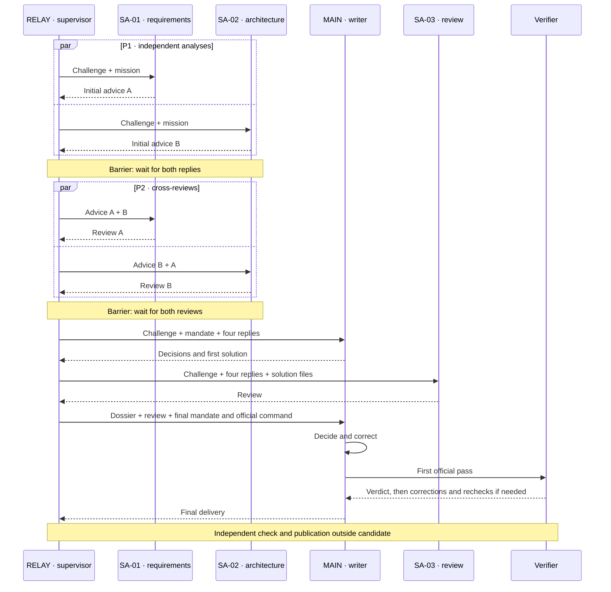

# Understand and analyse AgentBench

**English (UK)** · [Français](reading-guide.md) · [Español](reading-guide.es.md) · [Português](reading-guide.pt.md)

[README — 30 seconds](../README.en.md) → **this guide — 5 minutes** → [a run in 2 minutes](../results/run-summaries/index.en.md) → minutes/verbatim → trace and metadata → Python only to audit the engine.

## The question, without jargon

When does an AI team contribute enough to justify coordination? Exercises are the **simple calculator** (Core) and **scientific calculator** (Scientific), not “V1/V2 calculators”. V1, V2 and V3 are organisations: solo, advisory team, then proposed local consultants.

[Short conclusion](../results/CONCLUSIONS.en.md): in available same-model, same-effort comparisons, coordination costs exceed measured benefits. No break-even threshold is established. Perfect test results can still be less efficient.

## Level 1 — understand a run in five minutes

Open the [Scientific Astra medium summary](../results/run-summaries/astra-medium-scientific-v2-001.en.md). Read challenge, model/effort, team, sequence, first pass, independent verdict, corrections and costs. Finish with the decisive interaction and its evidence. Compare with the [simple summary](../results/run-summaries/astra-medium-core-v2-001.en.md): different difficulty, not an isolated V2/V1 effect.

| Question | Where to look |
| --- | --- |
| Challenge, model and effort? | Summary header; run.json and TOML configurations for audit |
| Who participates, writes or waits? | Roles below; summary sequence and sessions |
| Who receives what? | Diagram, transmission table and prompts in the minutes |
| First and final success? | Summary verdicts; [test catalogue](acceptance-tests.en.md) and independent report |
| Contributions, corrections and rejections? | Summary analysis → solution/DECISIONS.md → MSG-003 to MSG-007 |
| Time, tokens and calls? | Summary and run.json; sessions ≠ model calls, exact call count not recorded |
| Exact texts? | PV.md: “Texte envoyé, mot pour mot”, then “Texte retourné” |
| Events and changed files? | trace.json, decisions and solution; missing file_change does not exclude command-based writes |
| Continue development? | Solution README, module, decisions, checks; maintainability limitation below |

Summaries are an **editorial cover**, not rewritten historical minutes. Links still open the original verbatim.

## Who does what in V2?

| Identifier | Profession and boundary |
| --- | --- |
| RELAY | Mechanical supervisor: launches, waits, forwards, collects. External programme, not an AI candidate. Preparation and publication remain outside the candidate. |
| MAIN | Developer, arbiter and **sole writer**. Two fresh sessions of the same profession, not a fifth role. |
| SA-01 | Sub-agent 1 — requirements/security; advice without tools or writing. |
| SA-02 | Sub-agent 2 — architecture/testability; advice without tools or writing. |
| SA-03 | Sub-agent 3 — critical quality review after the first solution; no tools or writing. |
| Verifier | Independent programme, not a consultant’s opinion. |

Seven ephemeral sessions, four candidate roles. No shared persistent conversation: only explicitly transmitted information enables influence. “Cross-review” explains the historical “contradiction croisée”. We analyse coordination, not assumed psychology.

## V2 sequence — specified, not historical timing

| Phase | Information and possible influence |
| --- | --- |
| MSG-001/002, P1 | Separate challenge and mission; no peer advice. Concurrent launch does not guarantee exact simultaneity. |
| MSG-003/004, P2 | Own initial advice and peer advice. Challenge not re-injected as a separate block. No view of the peer’s simultaneous review. |
| MSG-005, initial MAIN | Challenge, mandate and four complete replies; first writing after both barriers. |
| MSG-006, SA-03 | Challenge, four replies, text snapshot of solution files including decisions. Not every MAIN command. |
| MSG-007, final MAIN | Mandate, challenge, four replies, snapshot, critique and official command. Fresh session of the same role; corrections then first pass. |

“MAIN/RELAY” in old minutes does not mean MAIN made a decision before its first session: RELAY forwards mechanically. The sequential MAIN → SA-03 → MAIN path limits acceleration; no two developers write in parallel.

## Level 2 — analyse the team

Separate **final quality**, **specialist contribution**, **information coordination**, **cost efficiency**. Two 6/6 scores can hide repetition without fixes or useful criticism outside official coverage.

| Kind | Defensible statement |
| --- | --- |
| Specified | Protocol requires two parallel groups and one writer. |
| Observed | A session has a counter, a command an output, a file some content. |
| Communicated | Advice appears in the recipient’s actual prompt; advice need not be true. |
| Interpreted | A recommendation appears to explain a change; give evidence and limits. |

**Proposal → transmission → arbitration → modification → observable effect.** Read MSG-006, MAIN’s decision, fix and check. Previously expressed advice is confirmation; refusal is arbitration without adoption. Without an observable earlier plan, do not claim to know what MAIN would have done alone.

| Analytical marker | Meaning and caution |
| --- | --- |
| [NOUVEAU] | New in accessible communications, not necessarily in the model’s thoughts. |
| [CONFIRMÉ] | Confirms an already expressed point. |
| [CONTESTÉ] | Visible disagreement or change of mind. |
| [RETENU] | MAIN accepts; effect is not yet proven. |
| [REJETÉ] | MAIN rejects; read the reason in decisions. |
| [IMPACT] | Observable change; distinguish score, supplementary check or documentation. |
| [BRUIT] | Argued hypothesis of uselessness; **no measured effect ≠ proven noise**. No reliable quantity calculated here. |

Post-hoc annotations live separately in [run-interpretations.json](run-interpretations.json); facts are generated from public JSON. AgentBench observes communications and effects, **not private internal reasoning**.

## Compare without overclaiming

Check challenge, verifier hash, model, effort, context, prompts and budget. Compare final score, first pass, fixes before/after, wall time, tokens, known sessions/calls, roles, useful advice, disagreements and repetition. Time + tokens + coordination is an intuition, not a dimensionally valid metric without weighting. The frozen decision rule remains unchanged.

Sum of session durations ≠ wall time. Cache is included in input, reasoning in output: no double counting. Total tokens ≠ simultaneous context occupancy. Missing ≠ zero. Separate interruptions and maintenance from completed runs.

Astra medium V1 and V2 baselines are complete on both calculators. [Full comparison and evidence](../results/astra-medium-v1-v2.en.md) [V1 Core](../results/astra-medium-v1-core.en.md) V2 medium versus V1 high does not isolate organisation. One observation per cell cannot establish generality or causality. Tests: 6 groups/14 simple checks, 9 groups/57 scientific checks. The four Scientific medium candidate tests are separate.

## Current status, history and continuing the code

[Results index](../results/README.en.md): Sol V2 and Astra medium V2 complete; Core Astra high complete; Scientific high interrupted. The [frozen V2 protocol](../governance/V2_PROTOCOL.en.md) and [old preflight](../results/astra-v2-preflight.en.md) describe freeze-time status, **not the current dashboard**, even where they say “not launched”. No retroactive correction.

V2.1 parallel development and V2.2 lean pair are future Astra medium variants; V2.x is their family. V3/Ollama is future. No launch here. To continue a module, read its README and decisions in a new directory, preserving candidate evidence. Comment/docstring counts do not measure maintainability. A future Vx handover test must freeze the requested change, available documentation, success, regressions, time and clarifications.

## Documentation work — delivered and limitations

- [x] Two reading levels, source table and communication diagram.
- [x] Five V2 summaries in four languages; evidence and interpretation separated.
- [x] Optional instrumentation and generation tested locally, without model sessions.
- [x] Governance, protocol and historical evidence preserved; documented audit.
- [ ] Validate instrumentation on a future authorised run; **no invented historical times**.

[Instrumentation and commands](observability.en.md) · [Verification report](documentation-audit.en.md)
