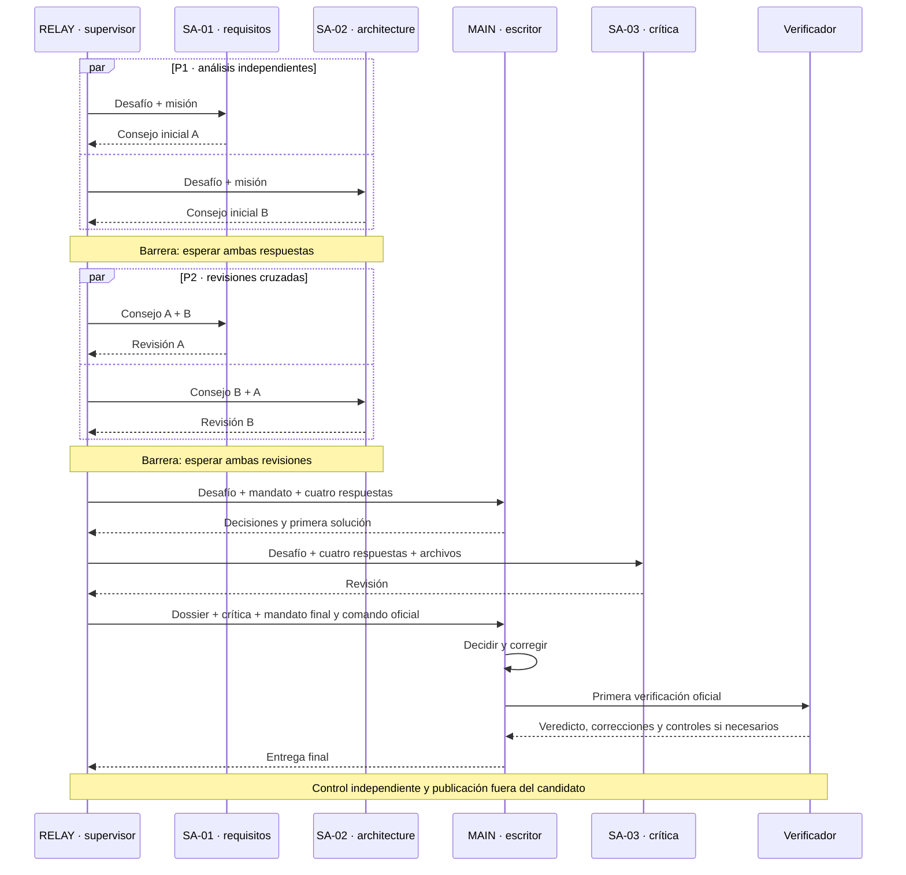

# Comprender y analizar AgentBench

**Español** · [Français](reading-guide.md) · [English (UK)](reading-guide.en.md) · [Português](reading-guide.pt.md)

[README — 30 segundos](../README.es.md) → **esta guía — 5 minutos** → [un run en 2 minutos](../results/run-summaries/index.es.md) → acta/verbatim → traza y metadatos → Python solo para auditar el motor.

## La pregunta, sin jerga

¿Cuándo aporta un equipo de IA lo suficiente para justificar su coordinación? Los ejercicios son **calculadora simple** (Core) y **calculadora científica** (Scientific), no «calculadora V1/V2». V1, V2 y V3 son organizaciones: solo, equipo consultivo y futuros consultores locales.

[Conclusión breve](../results/CONCLUSIONS.es.md): en las comparaciones disponibles con igual modelo y esfuerzo, la coordinación cuesta más que el beneficio medido. No existe un umbral demostrado. Pasar todos los tests no garantiza eficiencia.

## Nivel 1 — comprender un run en cinco minutos

Abrir el [resumen Scientific Astra medio](../results/run-summaries/astra-medium-scientific-v2-001.es.md). Leer desafío, modelo/esfuerzo, equipo, secuencia, primer pase, veredicto independiente, correcciones y costes. Terminar con la interacción decisiva y su prueba. Comparar con el [resumen simple](../results/run-summaries/astra-medium-core-v2-001.es.md): cambia la dificultad, no se aísla el efecto V2/V1.

| Pregunta | Dónde buscar |
| --- | --- |
| Desafío, modelo, esfuerzo | Cabecera; run.json y configuraciones TOML |
| Quién participa, escribe, espera | Roles siguientes; secuencia y sesiones del resumen |
| Quién recibe qué | Diagrama, tabla de transmisión y prompts del acta |
| Primer pase y resultado final | Veredictos; [catálogo de tests](acceptance-tests.es.md) e informe independiente |
| Aportes, correcciones, rechazos | Análisis → solution/DECISIONS.md → MSG-003 a MSG-007 |
| Tiempo, tokens, llamadas | Resumen y run.json; sesiones ≠ llamadas al modelo, número exacto de llamadas no registrado |
| Textos exactos | PV.md: «Texte envoyé, mot pour mot», después «Texte retourné» |
| Eventos y archivos modificados | trace.json, decisiones, solución; ausencia de file_change no excluye escrituras por comandos |
| Continuar el código | README de la solución, módulo, decisiones, controles; límite de mantenibilidad abajo |

Los resúmenes son una **portada editorial**, no actas históricas reescritas. Los enlaces conservan el verbatim original.

## ¿Quién hace qué en V2?

| ID | Profesión y límite |
| --- | --- |
| RELAY | Supervisor mecánico: lanza, espera, transmite, recoge. Programa externo, no candidato IA. Preparación y publicación fuera del candidato. |
| MAIN | Desarrollador, árbitro y **único escritor**. Dos sesiones nuevas del mismo rol, no un quinto oficio. |
| SA-01 | Subagente 1 — requisitos/seguridad; sin herramientas ni escritura. |
| SA-02 | Subagente 2 — arquitectura/testabilidad; sin herramientas ni escritura. |
| SA-03 | Subagente 3 — revisión crítica de calidad después de la primera solución; sin herramientas ni escritura. |
| Verificador | Programa independiente, no opinión de un consultor. |

Siete sesiones efímeras, cuatro roles candidatos. Sin conversación compartida permanente: solo la información transmitida posibilita influencia. «Revisión cruzada» explica la histórica «contradiction croisée». Analizamos coordinación, no psicología supuesta.

## Secuencia V2 — especificada, no cronología histórica medida

| Fase | Información e influencia posible |
| --- | --- |
| MSG-001/002, P1 | Desafío y misión separados; sin consejo del otro. Concurrencia no garantiza simultaneidad exacta. |
| MSG-003/004, P2 | Consejo inicial propio y del otro. Desafío no reenviado como bloque separado; sin acceso a la revisión simultánea del otro. |
| MSG-005, MAIN inicial | Desafío, mandato y cuatro respuestas completas; escritura tras ambas barreras. |
| MSG-006, SA-03 | Desafío, cuatro respuestas y snapshot textual de archivos, incluidas decisiones; no todos los comandos MAIN. |
| MSG-007, MAIN final | Mandato, desafío, cuatro respuestas, snapshot, crítica y comando oficial. Nueva sesión del mismo rol; correcciones y primer pase. |

«MAIN/RELAY» en actas antiguas no implica una decisión MAIN anterior a su primera sesión: RELAY transmite mecánicamente. MAIN → SA-03 → MAIN limita la aceleración; no hay dos desarrolladores escribiendo en paralelo.

## Nivel 2 — analizar el equipo

Separar **calidad final**, **aporte especializado**, **coordinación informativa** y **eficiencia**. Dos 6/6 pueden ocultar repetición sin correcciones o una crítica útil fuera de la cobertura oficial.

| Naturaleza | Afirmación defendible |
| --- | --- |
| Especificado | Dos grupos paralelos y un escritor según protocolo. |
| Observado | Contador de sesión, salida de comando, contenido de archivo. |
| Comunicado | Consejo presente en el prompt recibido; no necesariamente verdadero. |
| Interpretado | Consejo que parece explicar un cambio; aportar pruebas y límites. |

**Propuesta → transmisión → arbitraje → modificación → efecto observable.** Leer MSG-006, decisión MAIN, cambio y control. Consejo ya expresado = confirmación; rechazo = arbitraje sin adopción. Sin plan anterior observable, no afirmar qué habría hecho MAIN solo.

| Marcador analítico | Sentido y precaución |
| --- | --- |
| [NOUVEAU] | Nuevo en comunicaciones accesibles, no necesariamente en pensamientos. |
| [CONFIRMÉ] | Confirma algo ya expresado. |
| [CONTESTÉ] | Desacuerdo o cambio de opinión visible. |
| [RETENU] | MAIN acepta; efecto aún no probado. |
| [REJETÉ] | MAIN rechaza; motivo en decisiones. |
| [IMPACT] | Cambio observable; distinguir puntuación, control adicional y documentación. |
| [BRUIT] | Hipótesis razonada de inutilidad; **sin efecto medido ≠ ruido probado**. Sin volumen fiable calculado. |

Anotaciones posteriores separadas en [run-interpretations.json](run-interpretations.json); hechos generados desde JSON públicos. Observamos comunicaciones y efectos, **no razonamiento interno privado**.

## Comparar sin exagerar

Comprobar desafío, hash del verificador, modelo, esfuerzo, contexto, prompts y presupuesto. Comparar puntuación final, primer pase, correcciones antes/después, tiempo total, tokens, sesiones/llamadas conocidas, roles, aportes útiles, desacuerdos y repetición. Tiempo + tokens + coordinación es una intuición, no una métrica dimensional sin ponderación. La regla de decisión congelada no cambia.

Suma de duraciones de sesiones ≠ duración total. Caché incluida en entrada, razonamiento en salida: no contar dos veces. Tokens totales ≠ contexto simultáneamente ocupado. Ausente ≠ cero. Separar interrupciones y mantenimiento de runs completos.

Falta V1 Astra medio; comparar V2 medio con V1 elevado no aísla organización. Una observación por celda no demuestra generalidad ni causalidad. Tests: 6 grupos/14 controles simples, 9 grupos/57 científicos. Los cuatro tests candidatos Scientific medio son aparte.

## Estado actual, historia y continuación del código

[Resultados](../results/README.es.md): Sol V2 y Astra medio V2 completos; Core Astra elevado completo; Scientific elevado interrumpido. [Protocolo V2 congelado](../governance/V2_PROTOCOL.es.md) y [preflight antiguo](../results/astra-v2-preflight.es.md) describen el estado al congelar, **no el tablero actual**, aunque digan «no lanzado». Sin correcciones retroactivas.

V2.1 desarrollo paralelo y V2.2 pareja: variantes futuras Astra medio; V2.x: su familia. V3/Ollama futuro. Ningún lanzamiento aquí. Para continuar un módulo, leer README y decisiones en un directorio nuevo, preservando la prueba. Contar comentarios/docstrings no mide mantenibilidad. El futuro test Vx de relevo debe congelar cambio, documentación disponible, éxito, regresiones, tiempo y aclaraciones.

## Trabajo documental — entrega y límites

- [x] Dos niveles, tabla de fuentes y diagrama de intercambios.
- [x] Cinco resúmenes V2 en cuatro idiomas; hechos e interpretación separados.
- [x] Instrumentación opcional y generación probadas localmente, sin sesiones modelo.
- [x] Gobernanza, protocolo y pruebas históricas preservados; auditoría documentada.
- [ ] Validar instrumentación en un próximo run autorizado; **sin tiempos históricos inventados**.

[Instrumentación y comandos](observability.es.md) · [Informe de verificación](documentation-audit.es.md)
