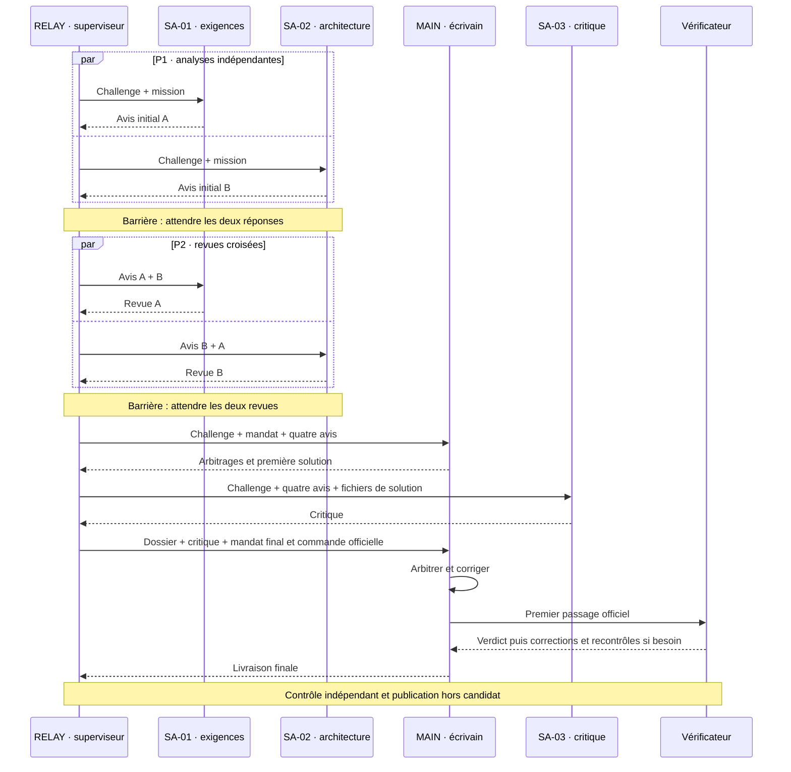

# Comprendre et analyser AgentBench

**Français** · [English (UK)](reading-guide.en.md) · [Español](reading-guide.es.md) · [Português](reading-guide.pt.md)

[README — 30 secondes](../README.md) → **ce guide — 5 minutes** → [un run en 2 minutes](../results/run-summaries/index.md) → PV/verbatim → trace et métadonnées → Python, seulement pour auditer le moteur.

## Le sujet, sans jargon

Quand une équipe d’IA apporte-t-elle assez pour justifier sa coordination ? Les exercices sont la **calculatrice simple** (Core) et la **calculatrice scientifique** (Scientific), pas « calculatrice V1/V2 ». V1, V2 et V3 désignent les organisations : solo, collectif consultatif, puis consultants locaux envisagés.

[Conclusion synthétique](../results/CONCLUSIONS.md) : sur les comparaisons disponibles à modèle et effort identiques, le coût de coordination dépasse le bénéfice mesuré. Aucun seuil de rentabilité n’est établi. Une solution parfaite aux tests peut être moins efficiente.

## Niveau 1 — comprendre un run en cinq minutes

Ouvrir le [résumé Scientific Astra moyen](../results/run-summaries/astra-medium-scientific-v2-001.md). Lire défi, modèle/effort, équipe, séquence, premier passage, verdict indépendant, corrections et coûts. Finir par l’interaction déterminante et sa preuve. Comparer au [résumé simple](../results/run-summaries/astra-medium-core-v2-001.md) : difficultés différentes, pas mesure isolée de l’effet V2/V1.

| Question | Où trouver la réponse ? |
| --- | --- |
| Quel défi, modèle et effort ? | En-tête du résumé ; run.json et configurations TOML pour l’audit |
| Qui participe, écrit ou attend ? | Métiers ci-dessous ; séquence et sessions du résumé |
| Qui reçoit quoi ? | Diagramme et tableau de transmission ; prompts du PV |
| Fonctionne-t-il au premier passage et à la fin ? | Verdicts du résumé ; [catalogue des tests](acceptance-tests.md) et rapport indépendant |
| Contributions, corrections et refus ? | Analyse du résumé → solution/DECISIONS.md → MSG-003 à MSG-007 |
| Temps, tokens et appels ? | Résumé et run.json ; sessions ≠ appels modèle, nombre exact d’appels non enregistré |
| Textes exacts ? | PV.md : « Texte envoyé, mot pour mot » puis « Texte retourné » |
| Événements et fichiers modifiés ? | trace.json, décisions et solution ; absence de file_change ≠ absence d’écriture par commande |
| Reprendre le code ? | README de la solution, module, décisions, contrôles ; limite de maintenabilité ci-dessous |

Les résumés sont une **couverture éditoriale**, pas une réécriture des PV historiques. Leurs liens ouvrent toujours le verbatim.

## Qui fait quoi en V2 ?

| Identifiant | Métier et frontière |
| --- | --- |
| RELAY | Superviseur mécanique : lance, attend, transmet, collecte. Programme externe, pas un candidat IA. Préparation et publication par l’orchestrateur restent hors candidat. |
| MAIN | Développeur, arbitre et **seul écrivain**. Deux sessions neuves du même métier, pas un cinquième rôle. |
| SA-01 | Sous-agent 1 — exigences et sécurité ; conseil sans outil ni écriture. |
| SA-02 | Sous-agent 2 — architecture et testabilité ; conseil sans outil ni écriture. |
| SA-03 | Sous-agent 3 — relecture qualité critique après la première solution ; sans outil ni écriture. |
| Vérificateur | Programme indépendant ; son verdict n’est pas l’avis d’un consultant. |

Sept sessions éphémères, quatre rôles candidats. Pas de conversation permanente partagée : seules les informations explicitement transmises rendent une influence possible. « Revue croisée » explique la « contradiction croisée » historique. On analyse une dynamique de coordination, pas une psychologie supposée.

## Séquence V2 — spécifiée, pas chronométrie historique

| Phase | Informations reçues et influence possible |
| --- | --- |
| MSG-001/002, P1 | Challenge et mission séparés ; aucun avis du pair. Départ concurrent, pas simultanéité exacte garantie. |
| MSG-003/004, P2 | Son avis initial et celui du pair. Challenge non réinjecté comme bloc distinct. Pas de vue sur la revue simultanée du pair. |
| MSG-005, MAIN initial | Challenge, mandat, quatre avis complets ; première écriture après les deux barrières. |
| MSG-006, SA-03 | Challenge, quatre avis, snapshot textuel des fichiers, décisions incluses. Pas toutes les commandes de MAIN. |
| MSG-007, MAIN final | Mandat, challenge, quatre avis, snapshot, critique et commande officielle. Nouvelle session du même métier ; corrections puis premier passage. |

« MAIN/RELAY » dans les anciens PV n’indique pas une décision de MAIN avant sa première session : RELAY transmet mécaniquement. Le chemin séquentiel MAIN → SA-03 → MAIN limite l’accélération ; pas deux développeurs écrivant en parallèle.

## Niveau 2 — analyser le collectif

Séparer **qualité finale**, **contribution des spécialistes**, **coordination de l’information**, **efficience des coûts**. Deux 6/6 peuvent cacher une répétition sans correctif ou une critique utile hors couverture officielle.

| Nature | Ce qu’on peut affirmer |
| --- | --- |
| Spécifié | Le protocole impose deux groupes parallèles et un seul écrivain. |
| Observé | Une session a tel compteur, une commande telle sortie, un fichier tel contenu. |
| Communiqué | Tel avis figure dans le prompt fourni au destinataire ; le conseil n’est pas nécessairement vrai. |
| Interprété | Une recommandation semble expliquer un changement ; fournir preuves et limites. |

**Proposition → transmission → arbitrage → modification → effet observable.** Lire MSG-006, décision MAIN, correctif et contrôle. Un conseil déjà exprimé est une confirmation ; un refus, un arbitrage sans adoption. Sans plan antérieur observable, ne pas prétendre savoir ce que MAIN aurait fait seul.

| Marqueur analytique | Sens et prudence |
| --- | --- |
| [NOUVEAU] | Absent des communications antérieures accessibles, pas des pensées du modèle. |
| [CONFIRMÉ] | Confirme un point déjà exprimé. |
| [CONTESTÉ] | Désaccord visible ou changement d’avis. |
| [RETENU] | MAIN adopte ; ne prouve pas encore un effet. |
| [REJETÉ] | MAIN refuse ; motif dans les décisions. |
| [IMPACT] | Modification observable ; préciser score, contrôle hors suite ou documentation. |
| [BRUIT] | Hypothèse argumentée d’inutilité ; **absence d’effet mesuré ≠ bruit prouvé**. Aucun volume fiable calculé ici. |

Annotations a posteriori séparées dans [run-interpretations.json](run-interpretations.json) ; faits générés depuis les JSON publics. AgentBench observe les communications et leurs effets, **pas le raisonnement interne privé**.

## Comparer sans surinterpréter

Vérifier défi, empreinte du vérificateur, modèle, effort, contexte, prompts et budget. Comparer score final, premier passage, correctifs avant/après, temps mural, tokens, sessions/appels connus, rôles, recommandations utiles, désaccords et répétitions. Temps + tokens + coordination reste une intuition, pas une métrique dimensionnée sans pondération. La règle de décision reste celle du protocole figé.

Somme des durées de sessions ≠ temps mural. Cache inclus dans entrée, raisonnement inclus dans sortie : pas de double comptage. Total de tokens ≠ contexte simultanément occupé. Donnée manquante ≠ zéro. Séparer interruptions et maintenance des runs complets.

La V1 simple Astra moyen est terminée ; seule la scientifique reste manquante. [V1 Core](../results/astra-medium-v1-core.md). Comparer V2 moyen à V1 élevé n’isole pas l’organisation. Une observation par cellule ne démontre ni généralité ni causalité. Tests : 6 groupes/14 contrôles simples, 9 groupes/57 contrôles scientifiques. Les quatre tests candidats Scientific moyen ne s’y ajoutent pas.

## État courant, historique et reprise du code

[Index des résultats](../results/README.md) : Sol V2 et Astra moyen V2 terminés ; Core Astra élevé complet ; Scientific élevé interrompu. [Protocole V2 figé](../governance/V2_PROTOCOL.md) et [ancien préflight](../results/astra-v2-preflight.md) décrivent l’état au gel, **pas le tableau de bord actuel**, même lorsqu’ils disent « pas encore lancé ». Pas de correction rétroactive.

V2.1 développement parallèle et V2.2 binôme : variantes futures Astra moyen ; V2.x : leur famille. V3/Ollama futur. Aucun lancement ici. Pour reprendre un module, lire son README et ses décisions dans un nouveau dossier ; conserver la preuve candidate. Compter les commentaires/docstrings ne mesure pas la maintenabilité. Le futur test Vx de reprise par un agent neuf devra figer évolution, documentation disponible, succès, régressions, temps et clarifications.

## Chantier documentaire — livré et limites

- [x] Deux niveaux, table des sources et diagramme des échanges.
- [x] Cinq résumés V2 en quatre langues ; preuves et interprétations séparées.
- [x] Instrumentation optionnelle et génération testées localement, sans session modèle.
- [x] Gouvernance, protocole et preuves historiques conservés ; audit documenté.
- [ ] Valider l’instrumentation sur un prochain run autorisé ; **aucun temps historique inventé**.

[Instrumentation et commandes](observability.md) · [Bilan de vérification](documentation-audit.md)
