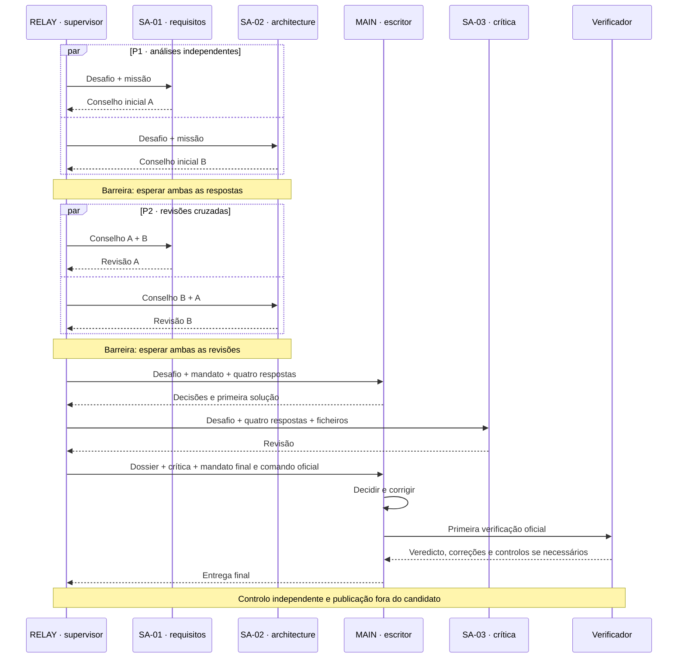

# Compreender e analisar AgentBench

**Português** · [Français](reading-guide.md) · [English (UK)](reading-guide.en.md) · [Español](reading-guide.es.md)

[README — 30 segundos](../README.pt.md) → **este guia — 5 minutos** → [um run em 2 minutos](../results/run-summaries/index.pt.md) → ata/verbatim → trace e metadados → Python apenas para auditar o motor.

## A pergunta, sem jargão

Quando contribui uma equipa de IA o suficiente para justificar a coordenação? Exercícios: **calculadora simples** (Core) e **calculadora científica** (Scientific), não «calculadora V1/V2». V1, V2 e V3 são organizações: solo, equipa consultiva e futuros consultores locais.

[Conclusão breve](../results/CONCLUSIONS.pt.md): nas comparações disponíveis com modelo e esforço iguais, a coordenação custa mais do que o benefício medido. Nenhum limiar demonstrado. Passar todos os testes não garante eficiência.

## Nível 1 — compreender um run em cinco minutos

Abrir o [resumo Scientific Astra médio](../results/run-summaries/astra-medium-scientific-v2-001.pt.md). Ler desafio, modelo/esforço, equipa, sequência, primeira passagem, veredicto independente, correções e custos. Terminar com interação decisiva e prova. Comparar com o [resumo simples](../results/run-summaries/astra-medium-core-v2-001.pt.md): muda a dificuldade, não isola o efeito V2/V1.

| Pergunta | Onde procurar |
| --- | --- |
| Desafio, modelo, esforço | Cabeçalho; run.json e configurações TOML |
| Quem participa, escreve, espera | Papéis abaixo; sequência e sessões do resumo |
| Quem recebe o quê | Diagrama, tabela de transmissão e prompts da ata |
| Primeira passagem e resultado final | Veredictos; [catálogo de testes](acceptance-tests.pt.md) e relatório independente |
| Contributos, correções, rejeições | Análise → solution/DECISIONS.md → MSG-003 a MSG-007 |
| Tempo, tokens, chamadas | Resumo e run.json; sessões ≠ chamadas ao modelo, número exato de chamadas não registado |
| Textos exatos | PV.md: «Texte envoyé, mot pour mot», depois «Texte retourné» |
| Eventos e ficheiros alterados | trace.json, decisões, solução; ausência de file_change não exclui escrita por comandos |
| Continuar o código | README da solução, módulo, decisões, controlos; limite de manutenção abaixo |

Os resumos são uma **capa editorial**, não atas históricas reescritas. Ligações preservam o verbatim original.

## Quem faz o quê em V2?

| ID | Profissão e limite |
| --- | --- |
| RELAY | Supervisor mecânico: lança, espera, transmite, recolhe. Programa externo, não candidato IA. Preparação e publicação fora do candidato. |
| MAIN | Programador, árbitro e **único escritor**. Duas sessões novas do mesmo papel, não uma quinta profissão. |
| SA-01 | Subagente 1 — requisitos/segurança; sem ferramentas nem escrita. |
| SA-02 | Subagente 2 — arquitetura/testabilidade; sem ferramentas nem escrita. |
| SA-03 | Subagente 3 — revisão crítica após primeira solução; sem ferramentas nem escrita. |
| Verificador | Programa independente, não opinião de consultor. |

Sete sessões efémeras, quatro papéis candidatos. Sem conversa partilhada permanente: só informação transmitida possibilita influência. «Revisão cruzada» explica a histórica «contradiction croisée». Analisamos coordenação, não psicologia suposta.

## Sequência V2 — especificada, não cronologia histórica medida

| Fase | Informação e influência possível |
| --- | --- |
| MSG-001/002, P1 | Desafio e missão separados; sem conselho do outro. Concorrência não garante simultaneidade exata. |
| MSG-003/004, P2 | Conselho inicial próprio e do outro. Desafio não reenviado como bloco separado; sem acesso à revisão simultânea do outro. |
| MSG-005, MAIN inicial | Desafio, mandato e quatro respostas completas; escrita após ambas as barreiras. |
| MSG-006, SA-03 | Desafio, quatro respostas, snapshot textual dos ficheiros e decisões; não todos os comandos MAIN. |
| MSG-007, MAIN final | Mandato, desafio, quatro respostas, snapshot, crítica e comando oficial. Nova sessão do mesmo papel; correções e primeira passagem. |

«MAIN/RELAY» nas atas antigas não implica decisão MAIN anterior à sua primeira sessão: RELAY transmite mecanicamente. MAIN → SA-03 → MAIN limita aceleração; não há dois programadores a escrever em paralelo.

## Nível 2 — analisar a equipa

Separar **qualidade final**, **contributo especializado**, **coordenação informativa** e **eficiência**. Dois 6/6 podem ocultar repetição sem correções ou crítica útil fora da cobertura oficial.

| Natureza | Afirmação defensável |
| --- | --- |
| Especificado | Dois grupos paralelos e um escritor segundo protocolo. |
| Observado | Contador de sessão, saída de comando, conteúdo de ficheiro. |
| Comunicado | Conselho presente no prompt recebido; não necessariamente verdadeiro. |
| Interpretado | Conselho que parece explicar uma mudança; apresentar provas e limites. |

**Proposta → transmissão → arbitragem → alteração → efeito observável.** Ler MSG-006, decisão MAIN, alteração e controlo. Conselho já expresso = confirmação; rejeição = arbitragem sem adoção. Sem plano anterior observável, não afirmar o que MAIN faria sozinho.

| Marcador analítico | Sentido e cautela |
| --- | --- |
| [NOUVEAU] | Novo nas comunicações acessíveis, não necessariamente nos pensamentos. |
| [CONFIRMÉ] | Confirma algo já expresso. |
| [CONTESTÉ] | Desacordo ou mudança de opinião visível. |
| [RETENU] | MAIN aceita; efeito ainda não provado. |
| [REJETÉ] | MAIN rejeita; motivo nas decisões. |
| [IMPACT] | Mudança observável; distinguir pontuação, controlo adicional e documentação. |
| [BRUIT] | Hipótese fundamentada de inutilidade; **sem efeito medido ≠ ruído provado**. Sem volume fiável calculado. |

Anotações posteriores separadas em [run-interpretations.json](run-interpretations.json); factos gerados de JSON públicos. Observamos comunicações e efeitos, **não raciocínio interno privado**.

## Comparar sem exagerar

Verificar desafio, hash do verificador, modelo, esforço, contexto, prompts e orçamento. Comparar pontuação final, primeira passagem, correções antes/depois, tempo total, tokens, sessões/chamadas conhecidas, papéis, contributos úteis, desacordos e repetição. Tempo + tokens + coordenação é intuição, não métrica dimensional sem ponderação. A regra de decisão congelada não muda.

Soma de durações de sessões ≠ duração total. Cache incluída na entrada, raciocínio na saída: não contar duas vezes. Tokens totais ≠ contexto simultaneamente ocupado. Ausente ≠ zero. Separar interrupções e manutenção de runs completos.

V1 e V2 Astra médio terminadas nas duas calculadoras. [Balanço completo e provas](../results/astra-medium-v1-v2.pt.md) [V1 Core](../results/astra-medium-v1-core.pt.md) comparar V2 médio com V1 elevado não isola organização. Uma observação por célula não demonstra generalidade nem causalidade. Testes: 6 grupos/14 controlos simples, 9 grupos/57 científicos. Os quatro testes candidatos Scientific médio são separados.

## Estado atual, história e continuação do código

[Resultados](../results/README.pt.md): Sol V2 e Astra médio V2 completos; Core Astra elevado completo; Scientific elevado interrompido. [Protocolo V2 congelado](../governance/V2_PROTOCOL.pt.md) e [preflight antigo](../results/astra-v2-preflight.pt.md) descrevem o estado no congelamento, **não o painel atual**, mesmo dizendo «não lançado». Sem correções retroativas.

V2.1 desenvolvimento paralelo e V2.2 dupla: variantes futuras Astra médio; V2.x: família. V3/Ollama futuro. Nenhum lançamento aqui. Para continuar um módulo, ler README e decisões num diretório novo, preservando a prova. Contar comentários/docstrings não mede manutenção. O futuro teste Vx de passagem deve congelar alteração, documentação disponível, sucesso, regressões, tempo e esclarecimentos.

## Trabalho documental — entrega e limites

- [x] Dois níveis, tabela de fontes e diagrama de trocas.
- [x] Cinco resumos V2 em quatro línguas; factos e interpretação separados.
- [x] Instrumentação opcional e geração testadas localmente, sem sessões modelo.
- [x] Governação, protocolo e provas históricas preservados; auditoria documentada.
- [ ] Validar instrumentação num próximo run autorizado; **sem tempos históricos inventados**.

[Instrumentação e comandos](observability.pt.md) · [Relatório de verificação](documentation-audit.pt.md)
