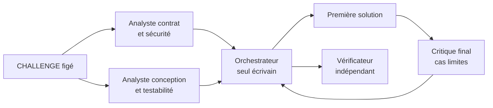

# Protocole V2 — Codex multi-agent gouverné

**Français** · [English (UK)](V2_PROTOCOL.en.md) · [Español](V2_PROTOCOL.es.md) · [Português](V2_PROTOCOL.pt.md)

## Statut et hypothèse

Ce protocole est figé avant le premier run V2. V2 teste si trois avis
spécialisés améliorent la qualité ou la convergence d'un écrivain unique à
conditions de modèle comparables, une fois le coût de coordination compté.

Les références courantes sont `codex-single-002` et
`scientific-single-002`. Les tentatives `001` restent des observations
historiques et ne sont pas écrasées.

## Variables contrôlées

| Paramètre | Valeur V1 de référence et V2 prévue |
| --- | --- |
| Modèle | `gpt-5.6-sol` |
| Effort de raisonnement | `high` |
| Fenêtre déclarée par agent | 200 000 tokens |
| Compaction automatique | 180 000 tokens, portée `total` |
| Sessions | neuves et éphémères |
| Défis et vérificateurs | versions actuellement figées |
| Dépendances | bibliothèque standard uniquement |
| Aide humaine fonctionnelle | aucune |

Avant le lancement, l'orchestrateur doit prouver que les limites de contexte
sont effectivement appliquées à chaque agent. Si l'outil de délégation ne les
expose pas, le run ne peut pas être annoncé comme appartenant à cette campagne
et une méthode d'exécution contrôlable doit être choisie.

## Organisation préenregistrée

- **Orchestrateur :** décide, écrit dans `solution/`, lance les contrôles et
  reste responsable du résultat final.
- **Consultant contrat/sécurité :** extrait les obligations, erreurs attendues
  et risques d'exécution ; lecture seule.
- **Consultant conception/testabilité :** propose structure, invariants et cas
  sensibles ; lecture seule.
- **Critique final :** examine la première solution et cherche omissions,
  régressions et cas limites ; lecture seule.

Il y a exactement trois consultants, sans sous-délégation. Les deux premiers
travaillent à partir du challenge avant l'écriture ; le troisième intervient
après une première solution. Aucun agent ne consulte une autre tentative.

## Séquence et droits

1. Créer une tentative V2 vierge et relire son `CHALLENGE.md`.
2. Vérifier modèle, effort, contexte, compaction, prompt et version CLI.
3. Solliciter en parallèle les deux analyses initiales dans des contextes
   séparés et bornés.
4. L'orchestrateur arbitre, implémente seul et documente la solution.
5. Le critique final effectue une revue en lecture seule.
6. L'orchestrateur retient ou écarte chaque point utile avec une justification
   synthétique, puis exécute le vérificateur officiel.
7. Corriger uniquement les défauts confirmés jusqu'au verdict final.

Pendant le run, seule `solution/` est inscriptible. Les opérations Git sont
interdites au candidat et aux consultants ; l'orchestrateur expérimental
publie les artefacts après clôture, dans un commit distinct.

## Mesures obligatoires

- score du premier passage et verdict final indépendant ;
- durée totale et, si disponible, durée par rôle ;
- tokens entrée, cache, sortie et raisonnement par agent lorsque l'outil les
  expose réellement ;
- appels de consultants, contradictions, recommandations retenues ou écartées ;
- corrections, interventions humaines et incidents d'infrastructure ;
- lignes et fichiers livrés, dépendances et limites observées.

Une donnée indisponible reste « non enregistrée ». La réussite fonctionnelle
ne suffit pas : V2 doit être comparée à V1 sur le coût total et le bruit social.

## Ordre de lancement

V2 Calculatrice Core sera exécutée et publiée en premier. V2 Calculatrice
Scientific ne commencera qu'après le gel du premier rapport, sans affinage
intermédiaire. Le jalon d'observation V2 intervient seulement après les deux
cellules. Toute modification des paramètres ci-dessus ouvre une nouvelle
campagne et impose les relances comparables prévues par le plan expérimental.
