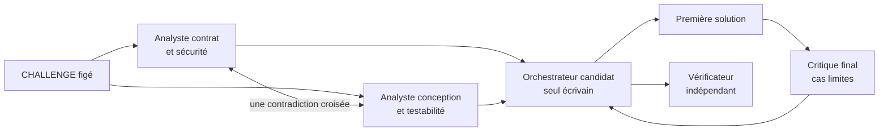

# Protocole V2 — Codex multi-agent gouverné

**Français** · [English (UK)](V2_PROTOCOL.en.md) · [Español](V2_PROTOCOL.es.md) · [Português](V2_PROTOCOL.pt.md)

## Statut et hypothèse

Ce protocole est prêt mais reste à arbitrer avant son gel et le premier run V2.
V2 teste si trois avis spécialisés améliorent la qualité ou la convergence
d'un écrivain unique dans des conditions de modèle comparables, une fois le
coût de coordination compté.

Les références courantes sont `codex-single-002` et
`scientific-single-002`. Les tentatives `001` restent des observations
historiques et ne sont pas écrasées.

## Arbitrages restant à confirmer

| ID | Décision | Recommandation | Conséquence d'une autre option |
| --- | --- | --- | --- |
| A-01 | Budget de contexte | **200k / compaction 180k** | 100k impose de rejouer V1 pour rester comparable |
| A-02 | Équipe | **trois métiers SA-01 à SA-03** | deux réduisent l'observation sociale ; quatre augmentent le bruit |
| A-03 | Relation sociale | **analyse aveugle puis une contradiction croisée** | une étoile pure n'observe pas la relation entre consultants |
| A-04 | Volume des réponses | **1 200 mots par analyse, 600 par contradiction, 1 200 pour la critique** | sans plafond, le coût token dépend trop du style |
| A-05 | Modèle et effort | **même `gpt-5.6-sol` / `high` pour tous** | spécialiser les modèles ajoute une variable confondante |
| A-06 | PV public | **textes visibles complets après filtrage des secrets** | une synthèse seule empêche l'analyse fine des influences |
| A-07 | Verdict d'efficacité | **tableau qualité/temps/tokens et dominance de Pareto** | un score composite impose des poids arbitraires |
| A-08 | Moteur d'exécution | **sous-agents natifs s'ils exposent configuration et compteurs par thread ; sinon sessions `codex exec --json` séparées** | choisir sans préflight peut rendre contexte et tokens invérifiables |

A-06 résulte directement de la demande du commanditaire. Les autres lignes
sont les réglages recommandés ; le run V2 ne commence qu'après leur validation.
Un préflight minimal, extérieur au benchmark, demande une réponse triviale à
un consultant et vérifie le rôle, l'isolation, la configuration, le texte
visible et les compteurs JSON. Il ne lit aucun challenge et n'entre dans aucune
mesure V1/V2.

## Variables contrôlées

| Paramètre | Valeur V1 de référence et V2 prévue |
| --- | --- |
| Modèle | `gpt-5.6-sol` |
| Effort de raisonnement | `high` |
| Fenêtre déclarée par agent | 200 000 tokens |
| Compaction automatique | 180 000 tokens, portée `total` |
| Sessions | neuves et éphémères |
| Défis et vérificateurs | versions actuellement figées |
| Dépendances | bibliothèque standard uniquement |
| Aide humaine fonctionnelle | aucune |

## Ce que signifie « limite de contexte validée »

Trois grandeurs différentes sont enregistrées sans les confondre :

- **capacité active :** `model_context_window = 200000` pour chaque thread ;
- **seuil de compaction :** `model_auto_compact_token_limit = 180000`, portée
  `total` ;
- **consommation cumulée :** somme des entrées et sorties de tous les appels,
  qui peut dépasser 200 000 sans que la fenêtre simultanée ait été dépassée.

La validation pré-run exige les cinq preuves suivantes :

1. un fichier de configuration propre à chaque métier contient modèle, effort,
   fenêtre et compaction ;
2. Codex accepte ces fichiers avec la validation stricte de configuration ;
3. chaque consultant démarre dans un thread neuf, sans historique de
   conversation hérité, avec seulement le challenge, sa mission et les
   artefacts explicitement autorisés ;
4. le rôle, l'identifiant de thread, les valeurs de configuration et
   l'empreinte SHA-256 du fichier sont inscrits dans `run.json` ;
5. le PV associe chaque texte visible et chaque compteur disponible au bon
   thread.

Cette procédure prouve la configuration du client Codex et l'isolation des
entrées ; elle ne prétend pas mesurer directement une limite interne du
serveur. Si la délégation native ne permet pas ces preuves, chaque consultant
est lancé dans une session `codex exec` éphémère distincte avec les mêmes
options. Sans l'une ou l'autre méthode vérifiable, le run est bloqué avant le
premier appel modèle.

La [référence de configuration Codex](https://developers.openai.com/codex/config-reference)
documente la fenêtre, la compaction, le modèle et l'effort ; la
[documentation des sous-agents](https://learn.chatgpt.com/docs/agent-configuration/subagents)
décrit les rôles personnalisés et leurs fichiers de configuration.

## Organisation préenregistrée



- **Candidat principal — orchestrateur/rédacteur :** décide, écrit dans
  `solution/`, lance les contrôles et reste responsable du résultat final.
- **SA-01 — analyste exigences et sécurité :** extrait obligations, erreurs,
  surfaces d'attaque et ambiguïtés ; lecture seule.
- **SA-02 — architecte logiciel et testabilité :** propose structure,
  invariants, stratégie de validation et cas sensibles ; lecture seule.
- **SA-03 — critique QA adversarial :** examine la première solution, la
  synthèse des décisions et cherche omissions, régressions et cas limites ;
  lecture seule.

Il y a exactement trois consultants, sans sous-délégation. Les deux premiers
travaillent d'abord indépendamment, puis reçoivent le texte intégral visible de
l'autre et produisent une seule contradiction ou révision. Le troisième
intervient après une première solution. Aucun agent ne consulte une autre
tentative.

## Séquence et droits

1. Créer une tentative V2 vierge et relire son `CHALLENGE.md`.
2. Vérifier modèle, effort, contexte, compaction, prompt et version CLI.
3. Envoyer en parallèle à SA-01 et SA-02 un mandat initial enregistré mot pour
   mot ; chacun rend une analyse indépendante.
4. Relayer intégralement la réponse de SA-01 à SA-02 et celle de SA-02 à SA-01 ;
   chacun dispose d'une réponse unique pour confirmer, contredire ou réviser.
5. Le candidat principal synthétise chaque proposition dans une table de
   décision, puis implémente seul et documente la solution.
6. SA-03 reçoit le challenge, la première solution et la table de décision,
   puis effectue une critique adversariale unique en lecture seule.
7. Le candidat principal qualifie chaque point de SA-03 — retenu, écarté ou
   non vérifiable — et justifie brièvement son arbitrage.
8. Il exécute le vérificateur officiel et corrige uniquement les défauts
   confirmés jusqu'au verdict final.

Pendant le run, seule `solution/` est inscriptible. Les opérations Git sont
interdites au candidat et aux consultants ; l'orchestrateur expérimental
publie les artefacts après clôture, dans un commit distinct.

## Mesures obligatoires

- score du premier passage et verdict final indépendant ;
- durée totale et, si disponible, durée par rôle ;
- tokens entrée, cache, sortie et raisonnement par agent lorsque l'outil les
  expose réellement ;
- appels de consultants, contradictions, recommandations retenues ou écartées ;
- [procès-verbal `PV.md`](PV_TEMPLATE.md) conservant mot pour mot chaque message inter-agent
  visible après contrôle des secrets, puis numérotant chaque mandat, avis,
  réponse et arbitrage avec l'identité du rôle et sa disposition motivée ;
- corrections, interventions humaines et incidents d'infrastructure ;
- lignes et fichiers livrés, dépendances et limites observées.

## Mesure du gain

Le rapport compare V2 à sa V1 de référence sans additionner arbitrairement des
secondes et des tokens :

```math
Q_{premier}=\frac{\text{tests réussis au premier passage}}{\text{tests totaux}}
\qquad
Q_{final}=\frac{\text{tests réussis au verdict final}}{\text{tests totaux}}
```

```math
R_{temps}=\frac{T_{V2}}{T_{V1}}
\qquad
R_{tokens}=\frac{K_{V2}}{K_{V1}}
\qquad
G_{qualité}=Q_{V2}-Q_{V1}
```

Sont publiés séparément le temps mural, la somme des temps-agents, les tokens
entrée/sortie par rôle, le volume des messages de coordination, les accords,
contradictions, doublons, recommandations retenues et défauts détectés. V2
domine V1 seulement si sa qualité n'est pas inférieure, ses coûts ne sont pas
supérieurs et au moins une dimension s'améliore strictement. Sinon le résultat
est présenté comme un compromis, pas comme une victoire.

Une donnée indisponible reste « non enregistrée ». La réussite fonctionnelle
ne suffit pas : V2 doit être comparée à V1 sur le coût total et le bruit social.

## Ordre de lancement

V2 Calculatrice Core sera exécutée et publiée en premier. V2 Calculatrice
Scientific ne commencera qu'après le gel du premier rapport, sans affinage
intermédiaire. Le jalon d'observation V2 intervient seulement après les deux
cellules. Toute modification des paramètres ci-dessus ouvre une nouvelle
campagne et impose les relances comparables prévues par le plan expérimental.
