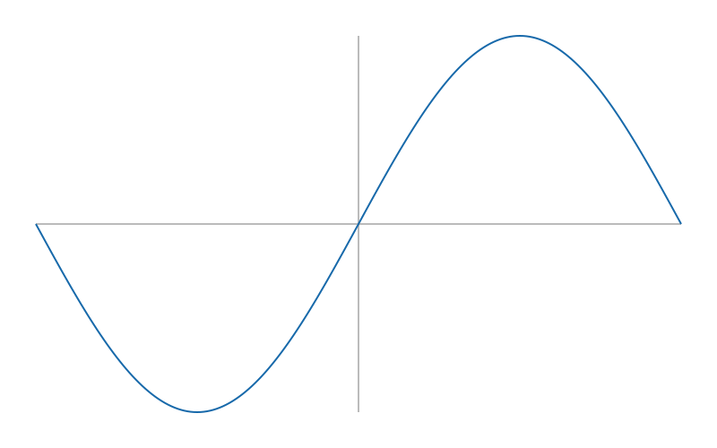

# Resultado detallado — `scientific-single-001`

[Français](scientific-single-001.md) · [English (UK)](scientific-single-001.en.md) · **Español** · [Português](scientific-single-001.pt.md)

## Resumen ejecutivo

El primer intento individual de la Calculadora Scientific terminó con **9
pruebas de 9**. Un agente Codex entregó un analizador seguro, funciones
científicas, muestreo de curvas, SVG autónomo y una CLI documentada sin
dependencias externas.

La primera pasada oficial validó 3/9 grupos. Una corrección eliminó una
incompatibilidad con el cargador de pruebas y otra corrigió la tokenización de
`log10`. El candidato convergió sin ayuda funcional humana.



El SVG es una demostración posterior al run, no una modificación del candidato.

## Identidad del run

| Dato | Valor |
| --- | --- |
| Identificador | `scientific-single-001` |
| Objetivo | Calculadora Scientific |
| Modo / arquitectura | Codex solo / un agente sin subagente |
| Modelo / razonamiento | `gpt-5.6-sol` / no expuesto |
| Prompt | [`prompts/scientific-single.md`](../prompts/scientific-single.md) |
| Duración | 5 min 31 s |
| Intervención humana funcional | Ninguna |
| Primera pasada | 3 éxitos, 6 errores |
| Resultado final / correcciones | 9/9 / 2 |

## Protocolo e implementación

Especificación, prompt y pruebas quedaron congelados en `71ae527` antes del
run. El candidato trabajó en un directorio limpio, no consultó otra solución y
solo escribió los dos entregables de `solution/`.

Un tokenizador de lista blanca y un analizador recursivo gestionan notación
científica, paréntesis, signos unarios, cinco operadores y potencia asociativa
a la derecha. Doce funciones, `pi`, `e` y únicamente `x` se conectan
explícitamente con `math`. Los resultados complejos, no finitos o fuera de
dominio generan `ValueError`; la división por cero conserva
`ZeroDivisionError`.

El muestreo divide los puntos no definidos y el SVG traza ejes y segmentos,
escapa el título y no contiene scripts ni recursos externos. La CLI evalúa,
dibuja, administra el historial y se recupera sin traceback.

## Recorrido de validación

| Pasada | Resultado | Diagnóstico | Acción |
| --- | --- | --- | --- |
| Controles dirigidos | Superados en la traza | Casos sensibles | Ninguna |
| Verificador oficial 1 | 3/9, 6 errores | Interacción `dataclass` / cargador | Sustituir dataclass |
| Intermedia | Código 1, salida ausente | `log10` dividido | Ampliar identificadores |
| Oficial final | 9/9 | Sin fallo restante | Cierre |
| Independiente | 9/9 | Resultado reproducido | Sin cambio |

El 8/9 intermedio mencionado por el candidato no es una medida segura porque
no se capturó la salida. La [traza](../runs/scientific-single-001/trace.md)
conserva esta precisión.

```bash
python3 scripts/verify.py \
  --challenge scientific-calculator \
  --solution runs/scientific-single-001/solution
```

## Medidas

| Indicador | Valor |
| --- | --- |
| Duración real | 331 segundos |
| Entrada / caché / sin caché | 324 237 / 303 360 / 20 877 tokens |
| Salida / razonamiento comunicado | 8 459 / 941 tokens |
| Comandos / lotes / mensajes | 8 / 3 / 9 |
| Archivos | 2 |
| Código / documentación | 352 / 64 líneas |
| Funciones / clases | 16 / 2 |
| Dependencias externas | 0 |

La entrada contiene mucha caché y no puede compararse directamente con la
estimación de Calculadora Core sin armonizar el método.

## Incidentes, límites y conclusión

Un lanzamiento previo falló antes del modelo por el almacén Codex en solo
lectura y no entra en la duración. El cargador rechazó un `dataclass` válido en
uso normal; las pruebas no se modificaron. El muestreo uniforme puede omitir
discontinuidades, las pruebas SVG no evalúan todos los motores y faltan el nivel
de razonamiento y la salida intermedia bruta.

V1 Scientific cumple el contrato en 331 segundos y dos correcciones autónomas.
La futura V2 deberá superar el mero 9/9 mediante una convergencia más rápida,
menos correcciones o mejor relación calidad/complejidad.
